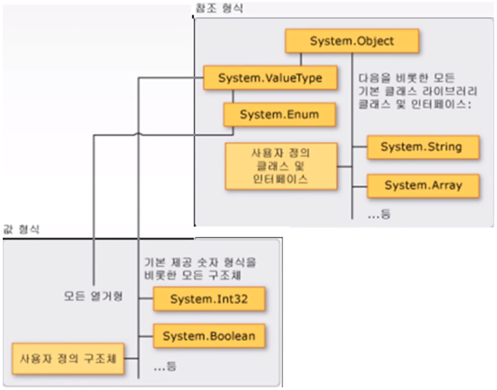

# 3. 데이터형
출처 : [나우캠퍼스 C#으로 살아남기](https://www.youtube.com/playlist?list=PLOKPEzlY4JKQNiHEQ4SDBxAFo9RDod8Tm)

## 1. 데이터형
- C#의 데이터형은 모두 __object로부터 파생된 객체__
__object는 IL언어에서는 System.Object형으로 CTS에 의해 정의된 형태대로 JIT컴파일러에 의해 변환되어 CLR에서 실행할 수 있게됨.__

- C언어의 경우

: int a가 메모리와 1:1 대응되어 4 byte를 할당하고 유효범위를 결정 메모리의 이름을 명시해주는 내용을 포함함.
- C#의 경우 

: 모든 데이터형은 object에서 파생된 객체, 메모리와 관련될 뿐만 아니라 메모리에 저장된 결과를 가공할 수 있는 메소드와 함수를 가짐. object가 가지는 메소드와 함수를 상속받아 가지고 있음.
## 2. 기본 데이터형
### 1.1 정수형
데이터형 | IL 언어 | 설명 | byte 할당
---|---|---|---|
bool | System.Boolean | true와 false만을 저장(C언어처럼 0/0아닌값을 저장할 수 없음) default는 false. | 1byte
char | System.Char | 문자상수 값을 저장(ex. int a = ‘7’ 암시적인 형변환이 일어남) , 유니코드로 문자와 숫자를 표현 – 키보드에 있는 문자키는 아스키코드값을 유니코드와 같게 만들어놓음 | 2 byte
byte | System.Byte | 1 byte를 할당 부호를 갖지 않음, 양수 (0~255) | 1 byte
sbyte | System.SByte | -128 ~ 127 (부호를 가짐) | 1 byte
short | System.Int16 | -32,768 ~ 32767 (유효범위 출력 : public const shor MinValue/MaxValue |2 byte
int | System.Int32 | -2,147,483,648 ~ 2,147,483,647 | 4 byte
long | System.Int64 | | 8 byte
ushort | System.UInt16 | 양의 정수 |2 byte
uint | System.UInt32 | | 4 byte
ulong | System.UInt64 | | 8 byte
- 변수들의 데이터형을 변경할 때 사용되는 메소드 이름이 주로 IL언어의 데이터형과 같아서 이름을 눈여겨 보면 좋음

### 1.2 실수형
데이터형 | IL 언어 | 설명 | byte 할당
---|---|---|---|
float | System.Single | 부동수소점 직접 값을 넣을 때 뒤에 f, F를 써넣어줘야함. 명시가 없으면 double형. | 4 byte
double | System.Double | 소수점 뒤에 f/ F명시가 없으면 double형 | 8 byte
decimal | System.Decimal | | 16 byte

### 1.3 문자열형
데이터형 | IL 언어 | 설명 | byte 할당
---|---|---|---|
string | System.String | | |
- C#에서 등장, 문자들을 메모리에 순차적으로 배열에 저장, 포인터를 이용해 데이터 크기를 유동적으로 지정, 문자형도 객체이기 때문에 이를 다룰 수 있는 메소드가 존재 ( C언어의 strlen()같은 변수와 분리된 함수를 쓰지 않아도 됨.)
- __C언어의 경우 문자열 끝 null문자로 0, ‘\0’으로 되어있음.__ 

ex) char Mun[3] =”abc” 는 null문자까지 저장되지 않는 에러. null문자가 필요한 부분에서 에러. 
- ‘+’ 연산자 : 문자열 연결하는 연산자로 쓸 수 있음. 사용 : 변수 + 변수 나 “문자열” + “문자열”
- == 연산자 : 문자열을 비교, C언어의 strcmp() 함수( 문자열이 같으면 0 아니면 0이외 값 반환하는 함수) 
- .Length : 문자열의 문자 개수를 반환하는 메소드, 사용 : 문자열.Length 주의) 메모리 사이즈와는 연관이 없음. 
- [인덱스] : 인덱스 = 문자열의 순서로 문자에 접근. char test[] = “abc”; (test[0]으로 a에 접근)
- 문자열에 ‘\’를 포함하는 경우 : 경로 @로 표현 : @”C:\temp\...” 나 “C:\\temp\\...”

### 1.4 암시적 데이터형 var (java)
- 데이터형이 결정되지 않고 데이터가 처음 대입될 때 데이터형이 결정됨

- __var형을 사용할 수 없는 예__ ***
1. __null값으로 초기화하는 경우__ 데이터형을 결정할 수 없음 
2. __매개변수__ 로 사용할 수 없다 – 함수에 값을 복사하거나 대입할 때 사용할 수 없다.
3. var형은 __지역변수로만 사용__ : 클래스 멤버로(생성해서 사용해야하는 경우)는 사용하지 못함.
4. __연속으로 초기화__ 하는 경우 (ex var m = 10, n = 20) : 개별적으로 초기화해야함.

- var 형에 데이터가 분명한 값으로 선언과 초기화. (처음 초기화가 된 값을 찾는 경우가 많음.)
var a= 3.14f; //f로 명시했기 때문에 분명하게 float 형으로 저장됨.
Console.Write(“{0:f1”(소수점 1째자리까지 출력}, a);

### 1.5 nullable형
: null을 허용하지 않는 데이터형이(기본데이터형들 값을 저장) 그 데이터형이 허용하는 값과 null값까지 저장할 수 있게 허용해논 데이터형.
- __null값을 저장하는 경우__ 

: 변수에 데이터가 없음, 데이터를 비교하는 용도, 데이터베이스 항목 안에 값이 없는 경우 null로 표현이 되서 이 것을 비교해주고 계산하기 위해.
- __형식__

```
데이터형 ? 변수명;
```
- 추가된 속성 

: __.HasValue__ // 값이 저장되어 있으면 true, null값이 저장되어있으면 false값 반환
.Value // 값을 읽어옴.

### 1.6 열거형
: 상수를 나열하여 쓰고자 할 때 문자열로 대치하여 선언해서 상수에 의미를 부여한다. 
- 변수의 범위 안에서만 사용되어야 되는데 그 외 값을 넣어 오류가 발생하는 경우가 있다. 따라서 상수를 문자열로 대치하여 사용하게 함.

## 2. 데이터형 변환
데이터 변환을 하기 위한 존재

### 2.1. ToString()

: 현재 데이터를 문자열로 바꾸어줌. WindowForm에서 출력값을 문자열로 저장할 수 있다. 숫자를 문자열로 바꿔 부분을 잘라낼 수 있다.

### 2.2. 기본데이터형.Parse(“문자열”)
: 문자열을 기본 데이터형으로 바꿔줌.

### 2.3. Convert 클라스에서 제공되는 메소드 
: Convert.ToInt32(), Convert.ToSingle() 쌔 다음에 해당하는 데이터형으로 바꿔줌(static형으로 되어서 바로 쓸 수 있음)


<details>
<summary> 입력받은 string형을 int형으로 바꾸기 </summary>
<div markdown = ”1”>

```C#
using System;

namespace ConsoleReadLine02
{
    class Program
    {
        static void Main(string[] args)
        {
            int Kor, Eng, Math, Total;
            float Average;
            Console.Write("국어 점수: ");
            Kor = Convert.ToInt32(Console.ReadLine());
            Console.Write("영어 점수: ");
            Eng = Convert.ToInt32(Console.ReadLine());
            Console.Write("수학 점수: ");
            Math = Convert.ToInt32(Console.ReadLine());
            Total = Kor + Eng + Math;
            Average = Total / 3.0f;
            Console.WriteLine("{0} {1} {2} {3} {4:f1}", Kor, Eng, Math, Total, Average);
        }
    }
}
```

</div></details>


## 2.2 박싱과 언박싱
### 박싱
: 데이터 형을 최상위 object형으로 변환하여 __힙(heap) 메모리__ 에 저장.
int m = 123;
__object__ obj = m;

### 언박싱
힙에 저장된 형식을 다시 원래의 형식으로 변환시켜 __복사해서 저장__ 옴
int n = (int)obj;

<details>
<summary> 박싱과 언박싱 : 메모리 공유가 발생하는지 확인 </summary>
<div markdown = ”1”>

```C#
using System;

namespace ConsoleApplication10
{
    class Program
    {
        static void Main(string[] args)
        {
            
            int i = 123;
            object obj = i; //박싱
            int n = (int)obj;// 언박싱
            i = 345;
            n = 567;
            obj = 789;
            Console.WriteLine("{0} {1} {2}", i, n, (int)obj); //obj출력 때 (int)형으로 명시


            object a = 111;
            object b = 222;
            a = b;
            b = 10;
            Console.WriteLine("{0}, {1}", a, b ); 
            
            //object형식으로 선언되었을 때 메모리를 공유하는 형태가 아님.
        }
    }
} 
```

- 실행 : 
345 567 789

222, 10

</div>
</details>

- object형으로 선언되었을 때 메모리를 공유하는 형태가 아님.

## 3. 표준 입력
### Console.ReadKey()
: 사용자가 눌린 키 한 문자 정보를 리턴하는 메서드

- __함수 원형__

public __static__ ConsoleKeyInfo ReadKey() : static이라 객체 생성 없이 메소드를 사용 가능.
public __static__ ConsoleKeyInfo ReadKey( bool intercept ) 
: true – 화면 출력 안 하면서 입력을 받음, false – 화면 출력 하면서 입력을 받음(default)

### ConsoleKeyInfo 구조체
: 키의 문자와 Shift, Alt, Ctrl 보조키 상태를 포함하고 있는 구조체.

- ConsoleKeyInfo 속성 :
1. __ConsoleKeyInfo.Key__ 요소 : 

ConsoleKey 열거형 값(문자열 값)으로 누른 키의 정보가 들어옴.(대/소문자 구분이 없음.)
누른 키 열거형 값 : ConsoleKey.A, ConsoleKey.Escpae 등 MSDN에 나옴.


<details>
<summary> ConsoleKey 예제 </summary>
<div markdown = ”1”>

```c# 
using System;

namespace ConsoleRead01
{
    class Program
    {
        static void Main(string[] args)
        {
            ConsoleKeyInfo keyInfo;
            do
            {
                KeyInfo = Console.ReadKey(false);
                if (KeyInfo.Key == ConsoleKey.A) // 소문자가 들어와도 대문자로 인식하는지
                    Console.WriteLine(“ConsoleKey.A가 눌렸다”); // a, A 눌를 때 다 뜸. 

            } while (KeyInfo.key != ConsoleKey.Escape);
        }
    }
}
```
출력 :
AConsoleKey.A가 눌렸다
aConsoleKey.A가 눌렸다


</div></details>

- 모든 키를 대문자로 인식.

2. __ConsoleKeyInfo.KeyChar__ 요소 : 
ConsoleKey 열거형 값(문자열 값)으로 누른 키의 유니코드 값이 들어옴. (대/소문자 구분 가능)

### 표준 출력
Console.WriteLine() 포맷

포맷 | 이름 | 예
---|---|----
C | currency | 123.456 ("C", en-US) -> $123.46
D | decimal | -1234 ("D6") -> -001234
E | exponential | 1052.0329112756 ("E", en-US) -> 1.052033E+003
F| Fixed-point | 1234 ("F1", en-US) -> 1234.0
X | hexadecimal | 255 ("X") -> FF


[MSDN](https://docs.microsoft.com/en-us/dotnet/standard/base-types/standard-numeric-format-strings?redirectedfrom=MSDN)

<details>
<summary> Console.WriteLine 포맷 </summary>
<div markdown = ”1”>


```c# 
using System;

namespace ConsoleApplication
{
    public struct MyStruct
    {
        public int Kor, Eng, Math, Total;
        public float Average;
        //구조체에 메소드 넣기
        public void Compute()
        {
            Total = Kor + Eng + Math;
            Average = Total / 3.0f;
        }
    }

    class program
    {
        static void Main(string[] args)
        {
            int a = int.Parse("100");
            float b = float.Parse("100.00");

            int c = 100;
            string d = c.ToString();

            float e = 100.00f;
            string f = e.ToString();

            Console.WriteLine("{0:c} {1:f2} {2:d6} {3:x4} {4:f} {5}", a, b, c, d, e, f);
            //출력 :  \100 100.00 000100 100 100.00 100
            
        }
    }
}

```

- string형 16진수로 출력 불가(오류는 안뜸)
- float형 16진수, deciaml로 출력 불가(오류 뜸)

</div></details>


## 4. 사용자 지정형

C#의 기본 데이터형 이외에 융통성 있게 사용자가 원하는 데이터형을 만들 수 있다.

- __종류 : struct, enum, class, interface__

## 4.1. 열거형 형식 enum

1) 기본은 int형 (4 byte 사용)

```
enum 열거형이름 { 문자열 1, 문자열 2} : 앞부터 0,1의 상수가 부여됨
enum 열거형이름 {문자열1 = 상수, 문자열2} : 상수에 10을 주면 그 후는 1씩 올라감.
enum 열거형이름 { 문자열 1 = 상수, 문자열 2 = 상수}; 상수를 전부 다 지정할 수 있다.
```
2) 형식 지정 : char형을 제외한 형식 지정을 할 수 있음

```
enum Days : byte {Sun =0, Mon, Tue, Wed, Thu, Fri, Sat}
```

- __열거형 변수가 아닌 변수에 열거형 값을 대입할 때는 데이터형을 명시해야한다.__

열거형 변수는 꼭 열거형 변수에만 사용해야 한다. 열거형 변수는 지정된 값을 문자열로 대체한 것이기 때문에 열거형 변수의 값은 열거형 변수에만 사용이 가능하다. 
그 열거형 값 자체가 int형이기 때문에 다른 데이터 형에 대입할 수 있는데 이를 위해 명시적으로 할 수 있는 cast연산자를 써서 데이터 형을 반드시 명시를 해서 대입해야한다.

<details>
<summary> 열거형 변수 사용</summary>
<div markdown = “1”>

```C#
using System;

namespace ConsoleApplication
{

    enum Days {Sun , Mon, Tue, Wed=10, Thu, Fri, Sat};
    //시작은 0으로 되다가 상수에 10 대입 그 후는 1씩 증가
    enum bDays : byte { Sun = 1, Mon, Tue, Wed, Thu, Fri, Sat }
     

    class program
    {
        static void Main(string[] args)
        {
            //열거형 변수의 값은 int형이고 원래는 열거형 변수에만 저장 가능
            Days day = Days.Tue;

            //일반 변수에 저장하기 위해 데이터형을 명시해서 변환시켜줌. (int)
            int nValue = (int)Days.Sun;
            int nValue2 = (int)Days.Tue;
            int nValue3 = (int)Days.Fri;
            string Value = Days.Mon.ToString();
            
            Console.WriteLine("Days : {0} {1} {2} {3} {4}", day, nValue, nValue2, nValue3, Value);
            //enum의 객체 type 반환? : day : typeof(day), day.GetType() 오류남….
            
            //tDays
            bDays bday = bDays.Tue;
            byte bnValue = (byte)bDays.Mon;
            string bValue = Days.Mon.ToString();

            Console.WriteLine("bDays : {0} {1} {2}", bday, bnValue, bValue);

        }
    }
}

```

</div>
</details>


## 4.2. 구조체 struct 

### 구조체의 형식

```
접근지정자 struct 구조체명
{
    //멤버, 속성, 메서드(C언어에서는 메소드를 구조체에 못 넣음)
}
```

### 구조체 사용 특징

### 1. 구조체에 안에 선언된 변수는 초기화 할 수 없다. 하지만, const, static(정적) 변수만은 초기화가 가능 하다.

public const float PI = 3.14f;

public static int Age = 12;

__static, const__ : 구조체의 객체를 선언을 해야 메모리가 할당 되어 쓸 수 있지만 static, const로 선언된 변수는 그냥 바로 쓸 수 있다.

<details>
<summary>구조체의 static/const 변수 초기화</summary>
<div markdown =”1”>

```C#
using System;

namespace ConsoleReadLine02
{
    // 구조체 안의 const, static 변수에 대해서만 선언과 동시 초기화가 가능한 예
    public struct MyStruct
    {
        public const float PI = 3.12f;
        public static int Age = 12;
        public int val;
    }
    class Program
    {
        static void Main(string[] args)
        {
            Console.WriteLine("{0} {1}", MyStruct.PI, MyStruct.Age);
            //static이나 const로 선언되지 않았기 때문에 객체를 생성하지 않으면 밑의 코드는 에러 : 
            //MyStruct.val = 10;

        }
    }
}
```
</div></details>

### 2. 구조체 안에 선언할 수 있는 생성자는 매개변수가 반드시 있어야 한다.
- 구조체의 경우, 값 형식이기 때문에 선언하거나 생성해서 사용한다. new를 통해 구조체를 생성할 때, 구조체 안에 생성자를 선언하면 항상 매개변수를 주어야 한다.

<details>
<summary>구조체의 static/const 변수 초기화</summary>
<div markdown =”1”>

```C#
using System;

namespace ConsoleReadLine02
{
    // 구조체에 생성자와 소멸자를 명시하고 new로 생성했을 때와 일반 선언 했을 때의 초기화 비교
    public struct MyStruct
    {
        public int Age;
        public MyStruct(int Age)
        {
            this.Age = Age;
        }
    }

    class Program
    {
        static void Main(string[] args)
        {
            //구조체의 static, const이외의 변수 초기화
            //외부에서 객체를 선언한 후 초기화
            MyStruct TestStruct1;
            TestStruct1.Age = 12;
            Console.WriteLine(TestStruct1.Age);
            
            //new, 기본생성자 호출
            //초기화 되지 않았기 때문에 기본값 0 출력)
            MyStruct TestStruct2 = new MyStruct();
            Console.WriteLine(TestStruct2.Age);
            
            //new, 구조체에 선언된 생성자에 매개변수를 주어 생성
            MyStruct TestStruct3 = new MyStruct(12);
            Console.WriteLine("{0}", TestStruct3.Age);
        }
    }
}
```

실행 결과
12
0
12 
</div></details>

### 3. 구조체를 같은 구조체에 대입하게 되면 값이 복사된다. (값 형식)

<details>
<summary>구조체 (값 형식)의 대입 연산자</summary>
<div markdown =”1”>

```C#
using System;

namespace ConsoleReadLine02
{
    // 구조체에 생성자와 소멸자를 명시하고 new로 생성했을 때와 일반 선언 했을 때의 초기화 비교
    public struct MyStruct
    {
        public int Age;
    }
    class Program
    {
        static void Main(string[] args)
        {
            MyStruct TestStruct1, TestStruct2;
            TestStruct2.Age = 10;
            //Console.WriteLine(TestStruct1.Age); // 선언 전 값을 사용하려면 에러 빨간 줄이 표시됨
            TestStruct1.Age= 0;
            Console.WriteLine(TestStruct1.Age);
            TestStruct1 = TestStruct2;
            Console.WriteLine(TestStruct1.Age); //복사되었기 때문에 10이 나옴

            MyStruct test;
            test = new MyStruct();
            Console.WriteLine(test.Age); //생성자로 생성한 경우 이미 0으로 초기화된 상태이기 때문에 에러가 안뜸


        }
    }
}```

실행 결과
0
10
0
</div></details>

### 4. 구조체는 값 형식이고 클래스는 참조 형식이다.
- __값 형식 (구조체)__ 

+ 대입연산자를 이용해 선언(=) , new를 이용해 생성(= new) : 모두 값 복사가 일어남

- __참조 형식 (클래스)__

+ 대입연산자를 이용해 선언(=) : 실제 객체로서 독립적으로 사용됨
+ new를 이용해 생성(= new) : 참조 형식이 됨.

: 실제 객체A가 생성되어 있을 때, 참조 형식의 클래스 형 참조 변수 B를 만들어 그 변수를 통해서 객체A를 참조한다.(포인터의 접근 개념) 

__=  A에 대한 다른 객체명을 가지게 되는 것, A에 있는 모든 객체를 B의 이름으로 다룰 수 있는 다른 이름을 선언하는 것이 된다__

<details>
<summary>값 형식, 참조 형식, 참조 변수 </summary>
<div markdown =”1”>

```C#

using System;

namespace ConsoleApplication
{
    public struct MyStruct
    {
        public int Age;
    }

    class MyClass
    {
        public int Age;
    }

    class Program
    {
        static void Main(string[] args)
        {
            MyStruct test1 = new MyStruct();
            test1.Age = 12;
            MyStruct test2 = test1; 
            test2.Age = 24;
            Console.WriteLine("Struct {0} {1}", test1.Age, test2.Age);
            //new를 통해서 생성했지만 값 형식이기 때문에 값 복사가 일어나서 
            //별개의 메모리에 독립적으로 할당됨
            //따라서 test 2를 바꿀 때 test1이 바뀌지 않음
            //결과 
            // 12, 24 출력

            MyClass test3 = new MyClass();
            test3.Age = 12;

            //1 new없이 대입 연산자
            MyClass test4 = test3;
            test4.Age = 24;
            Console.WriteLine("Class {0} {1}", test3.Age, test4.Age);
            //test4의 경우, new없이 대입 연산자를 쓰면 참조 변수가 됨. 
            //test4는 test3을 나타내는 또 다른 참조 변수가 되었으므로 test4를 바꾸는 것은 곧 test3을 바꾸는 것이 됨.
            // 24, 24 출력

            //2 new하고 대입 연산자
            MyClass test5 = new MyClass();
            test5 = test3;
            test5.Age = 36;
            Console.WriteLine("Class {0} {1}", test3.Age, test5.Age);
            //test5를 new로 생성해 메모리를 생성하면 독립적인 객체가 생김.
            //? test5를 test3에 복사하면 참조 변수가 되는지 독립된 객체의 메모리에 복사가 되는지?
            // 결과
            // 36 36
            //더이상 독립적으로 할당된 메모리 영역을 참조하지않고 참조 변수가 되어 test3을 가리킴
            
            //New 
            MyClass test6 = new MyClass();
            test6.Age = 10;

            //참조변수 test7로 test6을 가리킴.
            MyClass test7 = test6;
            //new 이용 새로운 test8 객체 생성서 test6을 참조
            MyClass test8 = new MyClass();
            test6 = test8;
            //? test6을 참조하고 있는 test7이 test6이 test8을 참조하게 되면 test7은 어떻게 되는지?
            test6.Age = 20;
            Console.WriteLine("Class {0} {1} {2}", test6.Age, test7.Age, test8.Age);
            //결과
            // 20 10 20
            //test7은 계속 test6이 참조하던 데이터 영역을 참조하고 
            //새로 생성된 test8의 영역을 test6과 8이 참조하고 있음.
        }
    }
}
</div></details>

### 5. 구조체는 값 형식이므로 선언만으로도 사용이 가능하다. 하지만 new를 사용했을 때만 생성자가 호출되고 기본값으로 초기화 된다.

<details>
<summary> 값 형식struct과 참조 형식class의 생성 비교</summary>
<div markdown =”1”>

```C#
using System;

namespace ConsoleApplication
{
    public struct MyStruct
    {
        public int Age;
        public float Num2;
        public bool IsReady;
    }

    class MyClass
    {
        public int Age;
    }

    class Program
    {
        static void Main(string[] args)
        {
            MyStruct test1 = new MyStruct();
            //new를 통해 생성된 int, float, bool 변수들은 어떤 값으로 초기화 되었을까?
            Console.WriteLine("Struct {0} {1}", test1.Age, test1.Num2, test1.IsReady);
            //0,0,False 출력
        }
    }
}

```
</div></details>

### 6. 구조체는 구조체 또는 클래스에 상속할 수 없다.
: C/C++ 구조체를 상속해서 쓸 수 있지만 C#에서는 불가능 하다.

### 7. 구조체는 인터페이스를 상속하여 메서드를 구현할 수 있음
인터페이스를 상속하면 그 하위에서 통일된 메서드 이름으로 선언을 하게 할 수 있다.


## 05. 값 형식과 참조 형식
## 값 형식과 참조 형식
선언과 동시에 바로 쓸 수 있다. 대입 연산자를 기준으로 복사가 이루어짐
선언만으로 사용할 수 없고 new를 통해 메모리를 확보해야함. new를 통해 생성하지 않은 변수는 참조 변수가 되고 자기와 동일한 객체를 대신하는 다른 이름으로 쓰임.
## 상속 관계
System.object : C#에서 모든 데이터의 최상위 클래스
(상속) - __참조 형식__ : System.String,Array… 등 모든 기본 클래스 라이브러리 클래스 및 인터페이스, 사용자 정의 클래스 및 인터페이스
                  : System.ValueType,Enum
- __값형식__ : 모든 열거형과 System.Int32,Boolean… 등 모든 기본 제공 숫자 형식을 비롯한 모든 구조체, 사용자 정의 구조체
 
</img>

## 값 형식
- System.Object를 통해 파생됨. + System.ValueType로부터 
- 변수가 직접 값을 저장하는 형
- 기본 데이터형, 구조체, 열거형
- 선언 vs 생성(new)
 : 선언 – 초기화가 안 되어 있다. , new이용 – 기본값으로 초기화가 되어있다. 

## 참조 형식
- 하나의 객체를 여러 개의 참조형 변수가 사용할 때, 모든 참조형들이 그 하나의 객체에 영향을 준다.
- class, interface

<details>
<summary> 참조 형식 배열의 참조형 배열 변수 사용 </summary>
<div markdown=”1”>

```C#
using System;

namespace ConsoleApplication
{

     

    class program
    {
        static void Main(string[] args)
        {
            int[] Array1 = { 1, 2, 3 };// 배열은 참조 형식
            int[] RefArray; // 참조형 배열 변수
            RefArray = Array1;
            RefArray[1] = 20;

            Console.WriteLine("{0} {1} {2}", Array1[0], Array1[1], Array1[2]);

        }
    }
}
```

</div></details>
