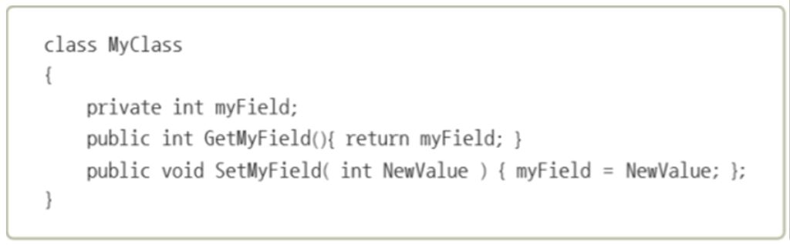
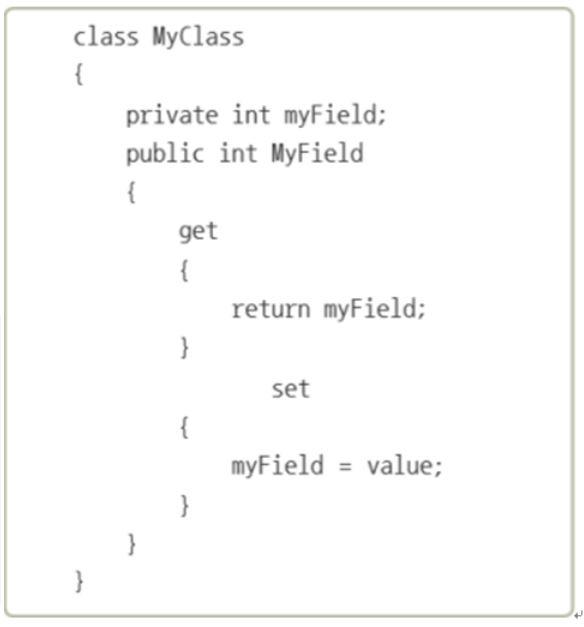
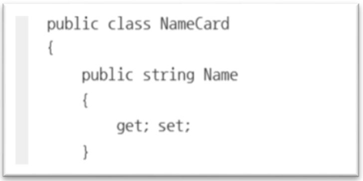
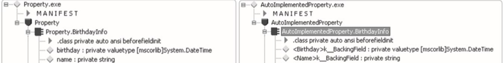
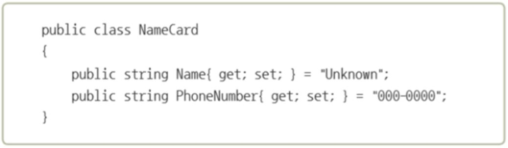

# 9. 프로퍼티

## 9.1 public 필드의 유혹
변수는 일반적으로 은닉성을 위해 __필드를 private__ 로 선언하는 것을 권장한다. 하지만 값을 할당하거나 저장된 값을 사용하려 할 때 변수에 값을 할당하는 함수와 저장된 값을 불러오는 __메소드를 public으로 선언해 접근__ 해야 된다.
이를 편리하게 접근하기 위해 필드를 public으로 선언해서 읽거나 할당할 수 있지만 은닉성을 잃기 때문에 권장하기 않는다.
- 이 때 __프로퍼티__ 를 이용하면 은닉성을 지키고 필드를 추가할 때마다 필드에 값을 할당하는 메소드와 저장된 값을 불러오는 메소드를 선언하지 않고 편리하게 사용 가능하다.


<details>
<summary>예제. private 필드의 메소드 메소드로 접근하기 </summary>
<div markdown="1">

```
Class MyClass
{
private int myField;
public int GetMyField(){ return myField; }
public void SetMyField( int NewValue) { myField = NewValue; };
}
```
</div>
</details>

- private 접근 한정자인 필드 myField는 외부에서 접근하려면(main 등) GetMyfield(), SetField() 메소드를 만들어줌.


## 9.2 메소드보다 프로퍼티
### 프로퍼티 선언 
private 필드를 public 프로퍼티를 이용해 접근한다.

__접근자 get__ 

: 저장된 값을 불러오기 위한 접근자, return 필드

__접근자 set__ 

: 필드에 값을 할당하기 위한 접근자

__value 키워드__ 

: set 접근자가 필드에 할당하는 값. 암묵적인 매개 변수로 간주.  

```C#
class 클래스 이름
{
    데이터형식 필드이름;
    접근한정자 데이터형식 프로퍼티이름
    {
        get { return 필드이름 };
        set { 필드이름 = value };
    }
}
```

<details>
<summary> + 예제 private 필드 메소드 이용 접근 </summary>
<div markdown="1">

```C#
//1. class 선언 - private 필드, public 메소드
class cA
{
    private int A;
    public int getA(){ return A; }
    public void setA ( int val ) { A = val; }
}

//2. 인스턴스 생성, 메소드를 이용해 필드 접근
class MainApp
{
  static void Main(string[] args)
  {
    cA yunha= new cA();
    yunha.setA(3);
    Console.WriteLine( yunha.getA() );
  }
}

```
</img>
</div>
</details>


<details>
<summary>+ 예제 private 필드 프로퍼티 이용 접근 </summary>
<div markdown="1">

```C#
//1. class 선언 - private 필드, public 프로퍼티 접근자 get, set과 키워드 value
class cA
{
    private int A;
    public int P           //메소드 모양- (매개변수)랑 ; 대신 중괄호{}
    {
        get { return A;  }
        set { A = value; }
    }
}

//2. 인스턴스 생성, 이름을 이용한 필드 접근 ( ‘=’ 사용)
class MainApp
{
  static void Main(string[] args)
  {
    cA yunha= new cA();
    yunha.P = 3;
    Console.WriteLine( yunha.P )
  }
}
```

</img>

</div>
</details>


## 9.3 자동구현 프로퍼티

### 프로퍼티를 선언하는 방법

1) 자동구현 프로퍼티
: __필드 선언과 get, set 접근자의 구현이 필요 없이__ get, set에 세미콜론만 붙여줌.

``` public string Name { get; set;}```

</img>

- __자동 구현 프로퍼티 뒤에서 일어나는 일__

: 코드에서 직접 필드를 선언하지 않아도 자동으로 구현되서 컴파일러가 대신 k_BackingFeild라는 이름을 붙여서 필드를 선언해줌.

</img>

2) 필드 선언과 동시에 초기화 (v.7부터)

``` public string Name { get; set;}= "unNAmed"```

</img>


## 9.4 프로퍼티와 생성자 (인스턴스 생성시 필드 초기화)

### 인스턴스를 생성할 때 각 필드를 초기화하는 방법

1. 객체 생성자에 __매개 변수를 입력__해서 객체의 각 필드를 초기화 

2. __프로퍼티__를 이용한 초기화 

두 가지가 있음

### 프로퍼티를 이용해 객체 생성과 동시에 초기화

```
클래스이름 인스턴스이름 = new 클래스이름( ){ 프로퍼티1 = 값 ,(쉼표) 프로퍼티2 = 값 , … }
```

** 목록의 모든 프로퍼티에 대해 값을 넣을 필요는 없음. 

```C# 
class Bday{
  public string Name { get; set;} = "Unknown";
  public DateTime Birthday{ get; set; } = new DateTime(1, 1, 1);
}

//main에서 인스턴스 생성할 때 초기화,
  Bday yunha = new Bday() { Name = ‘서현’, Birthday = new DateTime(1991, 6, 18) };
```

<details>
<summary> + 예제 : 인스턴스 생성과 초기화 </summary>
<div markdown="1">

```C#
using System;

namespace ConstructorWithProperty
{
    class BirthdayInfo
    {
        public string Name
        {
            get;
            set;
        }

        public DateTime Birthday
        {
            get;
            set;
        }

        public int Age
        {
            get
            {
                return new DateTime(DateTime.Now.Subtract(Birthday).Ticks).Year;
            }
        }
    }

    class MainApp
    {
        static void Main(string[] args)
        {
            BirthdayInfo birth = new BirthdayInfo()
            {
                Name = "서현",
                Birthday = new DateTime(1991, 6, 28)
            };

            Console.WriteLine("Name : {0}", birth.Name);
            Console.WriteLine("Birthday : {0}", birth.Birthday.ToShortDateString());
            Console.WriteLine("Age : {0}", birth.Age);
        }
    }
}

```

</div></details>

## 9.5 무명 형식

: 형식의 선언과 동시에 인스턴스를 할당(인스턴스 이름은 있다), 다시는 사용하지 않을 인스턴스를 만들 때 이용.
- 프로퍼티에 할당된 값은 변경이 불가. 

### 무명 형식의 선언
```C#
var yunha = new { Name=”박상현”, Age=”17};


- yunha 부분 : class mainApp의 객체 선언부분 : "mu yunha = new mu()" 부분
- {Name=…}부분 : class mu의 프로퍼티 선언부분 : "public string Name { get; set; } = “박상현”; …."
- 사용 : yunha.Name
```


```C#
class mu{}
class main에 mu yunha = new mu() { Name = ‘서현’, Birthday = new DateTime(1991, 6, 18) };
```

-15장 LINQ와 연결

<details>
<summary> + 예제 : 인스턴스 생성과 초기화 </summary>
<div markdown="1">

```C#
using System;

namespace AnonymousType
{
    class MainApp
    {
        static void Main(string[] args)
        {
            var a = new { Name="박상현", Age=123 };
            Console.WriteLine("Name:{0}, Age:{1}", a.Name, a.Age);

            var b = new { Subject = "수학", Scores = new int[] { 90, 80, 70, 60 } };

            Console.Write("Subject:{0}, Scores: ", b.Subject);
            foreach(var score in b.Scores )
                Console.Write("{0} ", score );

            Console.WriteLine();
        }
    }
}

```
</div></details>

## 9.6 인터페이스의 프로퍼티
- 인터페이스
: 메소드뿐만 아니라 프로퍼티와 인덱서도 가질 수 있다.
인터페이스를 상속하는 클래스는 반드시 이들을 구현해줌. (자동구현도 써도됨)
### 구현되지 않는 프로퍼티 
: abstract 한정자 사용해 구현 필수.

- ** 인터페이스에서의 프로퍼티 선언이 (get, set의 구현을 갖지 않아서) 클래스의 자동 구현 프로퍼티 선언 모습과 동일함. (get; set;) 
-> 컴파일러는 인터페이스 선언에서는 구현이 없는 걸 알고 있어서 구현하지 않음.

<details>
<summary> + 예제 : 인스턴스 생성과 초기화 </summary>
<div markdown="1">

```C#
using System;

namespace PropertiesInInterface
{
    interface INamedValue
    {
        string Name
        {
            get;
            set;
        }

        string Value
        {
            get;
            set;
        }
    }

    class NamedValue : INamedValue
    {
        public string Name
        {
            get;
            set;
        }

        public string Value
        {
            get;
            set;
        }
    }    

    class MainApp
    {
        static void Main(string[] args)
        {
            NamedValue name = new NamedValue() 
            { Name = "이름", Value = "박상현" };

            NamedValue height = new NamedValue() 
            { Name = "키", Value = "177Cm" };

            NamedValue weight = new NamedValue() 
            { Name = "몸무게", Value = "90Kg" };

            Console.WriteLine("{0} : {1}", name.Name, name.Value);
            Console.WriteLine("{0} : {1}", height.Name, height.Value);
            Console.WriteLine("{0} : {1}", weight.Name, weight.Value);
        }
    }
}


```
</div></details>

## 9.7 추상 클래스와 프로퍼티
: 추상 클래스는 클래스처럼 구현된 프로퍼티와 인터페이스처럼 구현되지 않은 프로퍼티(추상프로퍼티)를 가질 수 있다.

###추상 프로퍼티
: 추상 클래스의 프로퍼티. 파생클래스가 해당 프로퍼티를 구현하도록 강제하는 역할을 해줌.

** 인터페이스가 아니라서 클래스의 자동구현 프로퍼티 선언과 모습이 같은 인터페이스의 프로퍼티 선언 (get; set; ) 을 abstract 한정자로 구분해야함.

### 추상 프로퍼티의 선언
__abstract 한정자__

: 프로퍼티 맨 앞에 abstract만 붙여줌.

--> 상속받은 클래스에서 구현할 때 override 를 붙여줌.

<details>
<summary> + 예제 : 인스턴스 생성과 초기화 </summary>
<div markdown="1">

```C#
using System;

namespace PropertiesInAbstractClass
{
    abstract class Product
    {
        private static int serial = 0;
        public string SerialID
        {
            get { return String.Format("{0:d5}", serial++); }
        }

        abstract public DateTime ProductDate
        {
            get;
            set;
        }
    }

    class MyProduct : Product
    {
        public override DateTime ProductDate
        {
            get;
            set;
        }
    }

    class MainApp
    {
        static void Main(string[] args)
        {
            Product product_1 = new MyProduct() 
            { ProductDate = new DateTime(2010, 1, 10) };

            Console.WriteLine("Product:{0}, Product Date :{1}",
                product_1.SerialID, 
                product_1.ProductDate);

            Product product_2 = new MyProduct() 
            { ProductDate = new DateTime(2010, 2, 3) };
            
            Console.WriteLine("Product:{0}, Product Date :{1}",
                product_2.SerialID, 
                product_2.ProductDate);
            }
    }
}


```
</div></details>
