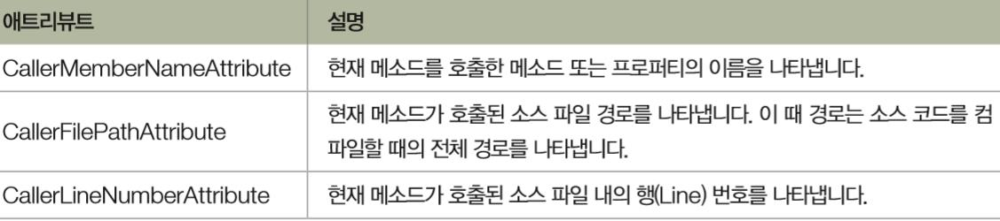

# 16. 리플렉션과 애트리뷰트

## 16.1 리플렉션
- __리플렉션__
: 객체의 형식 정보를 보는 기능, 실행 중 객체의 형식 이름, 프로퍼티, 메소드, 필드, 이벤트 목록을 열어볼 수 있다.
- 형식을 알 수 있다면 동적으로 인스턴스를 만들 수 있기 때문에 그 인스턴스의 메소드 호출이 가능함을 뜻함.
- Type형식이 담고 있는 정보: .Net에서 사용되는 데이터 형식의 모든 정보.
: 형식 이름, 소속되어 있는 어셈블리 이름, 프로퍼티 목록, 메소드 목록, 필드 목록, 이벤트 목록, 이 형식이 상속하고 있는 인터페이스의 목록.

## 16.1.1 Object.GetType() 메소드와 Type 클래스 
### Object 형식의 메소드 
- 모든 데이터 형식은 Object형식이 가지고 있는 다음 메소드를 물려받아 갖고 있다.
1. Equals()
2. GetHashCode()
3. GetType()
4.ReferenceEquals()
5. ToString()

### GetType() 메소드
: NET은 모든 데이터 형식의 조상인 Object를 이용 Object.GetType()메소드를 통해 Type 형식의 결과를 반환함. (Type type = a.GetType();)

### Type 형식 
Type 형식의 메소드 중 일부와 그 반환 형식 (MSDN 라이브러리의 System.Type의 매뉴얼 중)


 

GetFields()) 사용

```C#
int a = 0;
Type type = a.GetType();
// 필드정보를 목록으로[ ] 받아 foreach로 접근.
FieldInfo[] fields = type.GetFields();  
foreach (FieldInfo field in fields)
    Console.WriteLine(“Type:{0}, Name:{1}”, field.FieldType.Name, field.Name); 
```


### 검색 옵색 지정
- 매개변수로 System.Reflection.BindingFlags 열거형을 이용 
: BindingFlags.Public, BindingFlags.NonPublic, BindingFlags.Instance, BindingFlags.Static 등
- BindingFlags 매개 변수를 받지 않는 버전도 오버로등 되어있고 이 경우에는 public 멤버만 반환.

```
int a =0;
Type type = a.GetType();
//public 인스턴스 필드 조회
var fields1 = type.GetFields(BindingFlags.Public | BindingFlags.Instance); //FieldInfo[]로 안받고 var
```

<details>
<summary> 예제 : Type 형식의 메소드 사용 예제 </summary>
<div markdown="1">

```
using System;
using System.Collections.Generic;
using System.Text;
using System.Reflection;

namespace GetType
{
    class MainApp
    {
        static void PrintInterfaces(Type type)
        {
            Console.WriteLine("-------- Interfaces -------- ");

            Type[] interfaces = type.GetInterfaces();
            foreach (Type i in interfaces)
                Console.WriteLine("Name:{0}", i.Name);

            Console.WriteLine();
        }       

        static void PrintFields(Type type)
        {
            Console.WriteLine("-------- Fields -------- ");

            FieldInfo[] fields = type.GetFields( 
                BindingFlags.NonPublic | 
                BindingFlags.Public | 
                BindingFlags.Static | 
                BindingFlags.Instance );

            foreach (FieldInfo field in fields)
            {
                String accessLevel = "protected";
                if ( field.IsPublic ) accessLevel = "public";
                else if ( field.IsPrivate) accessLevel = "private";

                Console.WriteLine("Access:{0}, Type:{1}, Name:{2}", 
                    accessLevel, field.FieldType.Name, field.Name);
            }

            Console.WriteLine();
        }

        static void PrintMethods(Type type)
        {
            Console.WriteLine("-------- Methods -------- ");

            MethodInfo[] methods = type.GetMethods();
            foreach (MethodInfo method in methods)
            {
                Console.Write("Type:{0}, Name:{1}, Parameter:", 
                    method.ReturnType.Name, method.Name);
                
                ParameterInfo[] args = method.GetParameters();
                for (int i = 0; i < args.Length; i++)
                {
                    Console.Write("{0}", args[i].ParameterType.Name);
                    if (i < args.Length - 1)
                        Console.Write(", ");
                }
                Console.WriteLine();
            }
            Console.WriteLine();
        }

        static void PrintProperties(Type type)
        {
            Console.WriteLine("-------- Properties -------- ");

            PropertyInfo[] properties = type.GetProperties();
            foreach (PropertyInfo property in properties)
                Console.WriteLine("Type:{0}, Name:{1}", 
                    property.PropertyType.Name, property.Name);

            Console.WriteLine();
        }

        static void Main(string[] args)
        {
            //int a = 0;
            string a = "";
            Type type = a.GetType();
            
            PrintInterfaces(type);
            PrintFields(type);
            PrintProperties(type);
            PrintMethods(type);            
        }
    }
}
```

- __인터페이스 목록__: Type 형식으로 반환 받은 GetInterfaces()
- __필드 목록__: FieldInfo[] 형식으로 반환 GetFields()
BindingFlags 열거형 public, NonPublic, static, instance
Fieldinfo 의 (.Is~로) accessLevel : protected, public, private
- __메소드 목록__: MethodInfo[] 형식으로 반환 받은 .GetMethods()
 - ParameterInfo[] 형식으로 반환 받은 MethodInfo[] 의 .GetParameters() 메소드
- __프로퍼티 목록__ : PropertyInfo[]형식으로 반환받은 GetProperties()

</div>
</details>

### __Object.GetType() 메소드 대체__
- .GetType() 메소드는 반드시 객체의 인스턴스가 있어야 호출이 가능.( int a =0; 했던 것처럼 인스턴스를 만들고 초기화 해야함)
- 따라서 typeof 연산자와 Type.GetType() 메소드를 사용해서 Type 형식을 반환 받을 수 있다.
- typeof 연산자 : 형식의 식별자 자체를 매개 변수로 받음.
- Type.GetType() 메소드 : 형식의 전체 이름을 매개 변수로 받음 (예, 네임스페이스)

```
Type a = typeof(int);
Console.WriteLine(a.FullName);
Type b = Type.GetType(“System.Int32”);// 네임스페이스를 포함하는 전체 이름.
Console.WriteLine(b.FullName);
```

## 16.1.2 리플렉션을 이용해서 객체 생성하고 이용하기
- 리플렉션을 이용해서 특정 형식의 인스턴스를 만들고, 데이터를 할당하며, 메소드를 호출한다.
- __장점__ : 코드 안에서 런타임에 특정 형식의 인스턴스를 만들 수 있다.
: 우리는 조금 더 프로그램이 동적으로 동작할 수 있도록 구성할 수 있다.

### 1. 동적으로 인스턴스 생성
- __System.Activator 클래스__
: 리플렉션을 이용해 특정형식의 동적 인스턴스 생성할 때 필요.

- __Activator.CreateInstance()__ 
: 인스턴스를 만들고자 하는 형식의 Type 객체(__typeof( )__)를 매개 변수로 주면 인스턴스를 생성하여 반환함.

```
object a = Activator.CreateInstance(typeof(int));
//object 형식
```

- __Activator.CreateInstance() 일반화 버전__

```
List<int> list = Activator.CreateInstance<List<int>>();
```

```
class Profile {
public string Name { get; set; }
}
static void Main() { 
Type typeof(Profile);
Profile profile = (Profile)Activator.CreateInstance( type);
}

```
### 2. 동적으로 객체의 프로퍼티에 값 할당

- __PropertyInfo 클래스__
: Type.GetProperties()의 반환 형식

- PropertyInfo 클래스의 SetValue(), GetValue() 메소드
: 값 호출, 할당

- __Type.GetProperties() 메소드__ 
: 그 형식의 모든 프로퍼티를 PropertyInfo 형식의 배열로 반환

- __Type.GetProperty() 메소드__ 
: 특정 이름의 프로퍼티를 찾아 그 프로퍼티의 정보를 담은 하나의 PropertyInfo 객체만을 반환.

<details>
<summary> 예제 : 동적으로 메소드 호출 </summary>
<div markdown="1">

```C#
class Profile
{
public string Name { get; set; }
public string Phone { get; set; }
}
static void Main()
{
Type type = typeof(Profile);
Profile profile = (Profile)Activator.CreateInstance( type );

    profile.Name = “류현진”
profile.Phone = “010-1234-5678”
    
MethodInfo method = type.GetMethod(“Print”);
method.Invoke( profile, null );

Propertyinfo name = type.GetProperty(“Name”);
PropertyInfo phone = type.GetProperty( “Phone” );

name.SetValue ( profile, “박찬호”, null);
phone.SetValue( profile, “123-4567”, null);

Console.WriteLine(“{0}, {1}”, name.GetValue( profile, null ), phone.GetValue( profile, null));
}
```

- PropertyInfo 클래스는 프로퍼티 뿐만 아니라 인덱서의 정보도 담을 수 있다. 
__.SetValue와 GetValue의 마지막 매개 변수__ 
: 인덱서의 인덱스를 위한 자리.

</div></details>


- __MethodInfo 클래스의 Invoke() 메소드__
: MethodInfo클래스의 동적으로 메소드를 호출하는 것이 가능

<details>
<summary> 예제 : 동적으로 메소드 호출 </summary>
<div markdown="1">

```C#
class Profile
{
public string Name { get; set; }
public string Phone { get; set; }
Public void Print()
{
Console.Writeline(“{0}, {1}”, Name, Phone)
}
}
static void Main()
{
Type type = typeof(Profile);
Profile profile = (Profile)Activator.CreateInstance( type );
    profile.Name = “류현진”
profile.Phone = “010-1234-5678”
    
MethodInfo method = type.GetMethod(“Print”);
method.Invoke( profile, null );
}
</div></details>

<details>
<summary> 예제 : 동적으로 프로퍼티에 값을 기록, 호출 </summary>
<div markdown="1">

```C#
using System;
using System.Reflection;

namespace DynamicInstance
{
    class Profile
    {
        private string name;
        private string phone;
        public Profile()
        {
            name = ""; phone = "";
        }

        public Profile(string name, string phone)
        {
            this.name = name;
            this.phone = phone;
        }

        public void Print()
        {
            Console.WriteLine($"{name}, {phone}");
        }

        public string Name
        {
            get { return name; }
            set { name = value; }
        }

        public string Phone
        {
            get { return phone; }
            set { phone = value; }
        }
    }

    class MainApp
    {
        static void Main(string[] args)
        {
            Type type = Type.GetType("DynamicInstance.Profile");
            MethodInfo methodInfo = type.GetMethod("Print");
            PropertyInfo nameProperty = type.GetProperty("Name");
            PropertyInfo phoneProperty = type.GetProperty("Phone");

            object profile = Activator.CreateInstance(type, "박상현", "512-1234");            
            methodInfo.Invoke(profile, null);

            profile = Activator.CreateInstance(type);            
            nameProperty.SetValue(profile, "박찬호", null);            
            phoneProperty.SetValue(profile, "997-5511", null);

            Console.WriteLine("{0}, {1}",
                nameProperty.GetValue(profile, null),
                phoneProperty.GetValue(profile, null));
        }
    }
}
```

</div></details>

## 16.1.3 형식 내보내기
리플렉션을 이용해 프로그램 실행 중에 새로운 형식을 만들어 낼 수 있는 기능.
### 리플렉션에서의 emit
= 프로그램이 실행 중에 만들어낸 새 형식을 CLR의 메모리에 “내보낸다”
### Emit 네임스페이스 제공하는 클래스들
: 코드를 만든다는 뜻에서 “~Builder”의 꼴의 이름을 갖고 있다.

### 새로운 형식을 만드는 순서 (형식 = Type)
1. System.AppDomain 클래스로 AssemblyBuilder 객체 만들기 : __DefineDynamicAssembly()__로 어셈블리 만들기

2. __DefineDynamicModule()__ 메소드로 생성한 어셈블리 안에 모듈 만들기

3. ModuleBuilder의 __DefineType()__메소드로 생성한 모듈 안에 클래스(형식) 만들기

4. TypeBuilder 클래스의 __DefineMethod()__ 메소드로 생성한 클래스 안에 메소드 껍데기 만들기/ PropertyBuilder 클래스의 __DefineProperty()__나 프로퍼티 껍데기 만들기 
:매개변수로 (“이름”, MethodAttribute, 반환형식, 매개 변수)가 필요
- 메소드 define : MethodAttributes.Public, 프로퍼티 define : MethodAttributes.HasDefault 사용했음
- 프로퍼티의 Set/Get 메소드의 define은 특별한 Attriibutes 사용 : ( MethodAttributes.Public | MethodAttribures.SpecialName | MethodAttributes.HideBySif )

5. MethodBuilder 클래스의 __GetILGenerator()__를 통해 IlGenerator객체 만들기 

6. ILGenerator 객체의 __.Emit__ 이용 해서 메소드가 실행할 코드(IL 명령어) 채우기
(OpCodes.Ldc_I4, i) : 32비트 정수 ( I )를 계산 스텍에 넣음
(OpCodes.Add) : 계산스텍에 담겨 있는 두개의 값을 꺼내서 더한후 결과를 다시 계산 스택에 넣기
(OpCodes.Ldarg_i) : 인덱스 i에 있는 인수를 계산 스택으로 로드
(OpCOdes.Ldfld, FieldBuilder 객체) 현재 계산 스택에 참조가 있는 개체에서 필드의 값을 찾음.
(OpCodes.Stfld, FieldBuilder 객체) 개체 참조나 포인터의 필드에 저장된 값을 새 값으로 바꿈
(OpCodes.Ret) : 스택에 있는 값을 반환
- ildasm 명령어로 C#에서 코드를 짜서 조회해보면 IL코드를 볼 수 있다.

7. Type 객체에서 __CreateType()__ 메소드로 형식(클래스)를 CLR에게 내보내기

// 새로 만든 형식 사용
8. __.CreateInstance()__ 이용해서 인스턴스를 동적으로 생성 (object 형식의 객체)

9. __GetType().GetMethod()__ 이용해서 methodIfo 객체 만들기

10. methodInfo 객체의 .Invoke()이용해서 메소드 사용

<details>
<summary>예제 : 새로운 형식을 만들고 인스턴스를 동적으로 생성해 사용</summary>
<div markdown="1">

```C#
using System;
using System.Reflection;
using System.Reflection.Emit;

namespace EmitTest
{
    public class MainApp
    {
        public static void Main()
        {
            AssemblyBuilder newAssembly =
                AppDomain.CurrentDomain.DefineDynamicAssembly(
                    new AssemblyName("CalculatorAssembly"), AssemblyBuilderAccess.Run);
            
            ModuleBuilder newModule = newAssembly.DefineDynamicModule("Calculator");
            TypeBuilder newType = newModule.DefineType("Sum1To100");

            MethodBuilder newMethod = newType.DefineMethod(
                "Calculate",
                MethodAttributes.Public,
                typeof(int),    // 반환 형식
                new Type[0]);   // 매개 변수

            ILGenerator generator = newMethod.GetILGenerator();

            generator.Emit(OpCodes.Ldc_I4, 1);

            for (int i = 2; i <= 100; i++)
            {
                generator.Emit(OpCodes.Ldc_I4, i);
                generator.Emit(OpCodes.Add);
            }

            generator.Emit(OpCodes.Ret);
            newType.CreateType();

            object sum1To100 = Activator.CreateInstance(newType);
            MethodInfo Calculate = sum1To100.GetType().GetMethod("Calculate");
            Console.WriteLine(Calculate.Invoke(sum1To100, null));
        }
    }
}
```
</div></details>

## 16.2 애트리뷰트
: 애트리뷰트는 코드에 대한 부가 정보를 기록하고 읽을 수 있는 기능
- 주석과의 차이 : 컴퓨터가 읽는 것.

## 16.2.1 애트리뷰트 사용하기
- 사용 형식

```C#
[ 애트리뷰트_이름( 애트리뷰트_매개변수) ]
public void Mymethod() { … }
```

### .NET 프레임워크에서 기본적으로 제공하는 애트리뷰트 
- [Obsolete] : 실행 시 경고창에 메소드를 출력할 때 사용

``` 
[Obsolete( “ … “ ) ]
```

- [DILImport] : 네이티브 DIL에 있는 함수를 호출할 때 사용
- [Conditional] : 조건부 메소드 실행을 지정할 때 사용.

## 16.2.2 호출자 정보 애트리뷰트
: 호출자의 정보를 반환해줌. 메소드의 호출자 이름, 호출자 메소드가 정의되어 있는 소스 파일 경로, 소스 파일 내의 행 번호 등을 반환 받아 사용할 수 있다.
메소드의 매개 변수에 사용


 

## 16.2.3 내가 만드는 애트리뷰트
애트리뷰트도 하나의 클래스이기 때문에 사용자가 필요에 의해 만들 수 있다. 
- 모든 애트리뷰트는 __System.Attribute 클래스__로부터 상속을 받아 만듦.

### System.AttributeUsage()
: 애트리뷰트가 어떤 대상을 설명할지, 이 애트리뷰트를 중복해서 사용할 수 있는지의 여부 설명(애트리뷰트의 애트리뷰트)
### 매개변수
- __첫번째 매개변수__ : Attribute Target
: 지금 선언하고 있는 애트리뷰트의 설명 대상이 무엇인지 나타냄.
논리합 연산자를 이용해 결합도 가능
- __옵션__ : 
__AllowMultiple__ = True : 애트리뷰트의 중복 사요을 가능하게 함.


<details>
<summary> 예제 사용자 정의 애트리뷰트(history)와 사용</summary>
<div markdown=”1”>

```C#
using System;

namespace HistoryAttribute
{
    [System.AttributeUsage(System.AttributeTargets.Class, AllowMultiple=true)]
    class History : System.Attribute
    {
        private string programmer;
        
        public double Version
        {
            get;
            set;
        }
        
        public string Changes
        {
            get;
            set;
        }

        public History(string programmer)
        {
            this.programmer = programmer;
            Version = 1.0;
            Changes = "First release";
        }

        public string Programmer
        {
            get { return programmer; }
        }
    }

    [History("Sean", 
        Version = 0.1, Changes = "2010-11-01 Created class stub")]
    [History("Bob", 
        Version = 0.2, Changes = "2010-12-03 Added Func() Method")]
    class MyClass
    {
        public void Func()
        {
            Console.WriteLine("Func()");
        }
    }

    class MainApp
    {
        static void Main(string[] args)
        {
            Type type = typeof(MyClass);
            Attribute[] attribues = Attribute.GetCustomAttributes(type);

            Console.WriteLine("MyClass change history...");

            foreach (Attribute a in attribues)
            {
                History h = a as History;
                if (h != null)
                    Console.WriteLine("Ver:{0}, Programmer:{1}, Changes:{2}",
                        h.Version, h.Programmer, h.Changes);
            }
        }
    }
}
```

</div></details>
