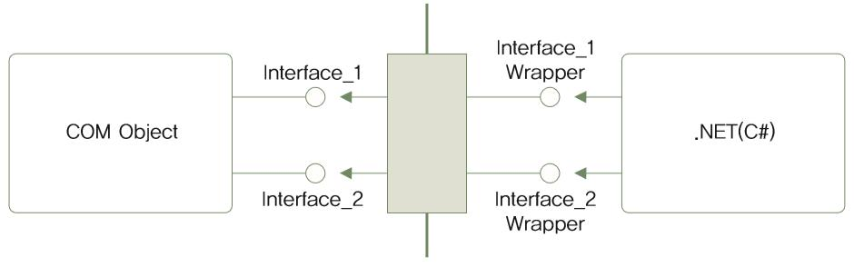
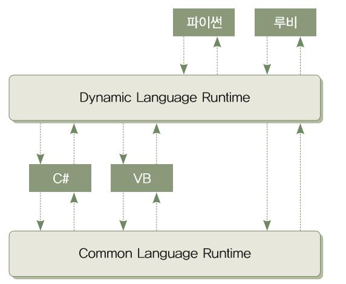

# 17. Dynamic 형식

## 17.1 dynamic 형식 소개
: 형식 검사가 컴파일할 때 이루어지지 않고 프로그램 실행 중 이루어지는 하나의 데이터 형식. (int, string 같은)
- dynamic 형식으로 선언된 객체는 일단 컴파일러의 형식 검사를 피해감.

## 17.1.1 오리 타이핑
: 어느 형식을 상속받는지와 관계없이 같은 메소드와 프로퍼티를 구현한다면 같은 형식으로 인정

<details>
<summary> 예제 : 오리타이핑 </summary>
<div>

```C#
using System;

namespace DuckTyping
{
    class Duck
    {
        public void Walk()
        { Console.WriteLine( this.GetType() + ".Walk"); }

        public void Swim()
        { Console.WriteLine( this.GetType() + ".Swim"); }

        public void Quack()
        { Console.WriteLine( this.GetType() + ".Quack"); }
    }

    class Mallard : Duck
    { }

    class Robot
    {
        public void Walk()
        { Console.WriteLine("Robot.Walk"); }

        public void Swim()
        { Console.WriteLine("Robot.Swim"); }

        public void Quack()
        { Console.WriteLine("Robot.Quack"); }
    }

    class MainApp
    {
        static void Main(string[] args)
        {
            dynamic[] arr = new dynamic[] {new Duck(), new Mallard(), new Robot() };

            foreach (dynamic duck in arr)
            {
                Console.WriteLine(duck.GetType());
                duck.Walk();
                duck.Swim();
                duck.Quack();

                Console.WriteLine();
            }
        }
    }
}
```

</div></details>

### 17.1.2 오리 타이핑의 장점과 단점
### 장점 
- 오리 타이핑의 경우 상속 관계를 이용하지 않아 프로그램의 동작 관련 부분만 수정 가능 
: 잘못된 인터페이스를 설계하면 파생 클래스와 형제 클래스를 전부 수정해야 한다.

### 단점
- 오리 타이핑의 경우 직접 모든 메소드 선언을 찾아서 수정해야한다. 
: 오리 타이핑을 사용하지 않으면 Visual Studio의 리팩터링 기능 이용 불가

## 17.2 COM과 .NET 사이의 상호 운용성을 위한 dynamic 형식
### COM(Component Object Model)
: 마이크로소프트의 소프트웨어 컴포넌트 규격. COM API를 사용하면 엑셀 문서를 읽거나 쓸 수 있음.

### RCW(Runtime Callable Wrapper)
- .NET 언어들의 경우, RCW를 통해 COM 컴포넌트를 사용할 수 있다. COM 객체를 프로젝트 참조에 추가하면 IDE가 자동으로 tlbimp.exe를 호출해서 RCW를 만들어주고 이는 COM에 대한 프록시 역할(대리)을 해서 C#코드에서 COM API를 사용할 수 있게 해줍니다. 


 

- C#과 COM 사이의 상호 운용성을 좋지 않게 만든 원인
1. COM은 메소드가 결과를 반환할 때 실제 형식이 아닌 __object 형식으로 반환__
: C# 4.0에서 __dynamic 도입__해 이 문제를 해결
2. COM은 오버로딩을 지원하지않고 메소드의 선택적 매개 변수와 기본값 매개 변수 지원
: C# 4.0에서 __선택적 매개 변수와 기본값 매개 변수 지원__으로 해결
=무의미한 형식 변환과 의미 없는 매개 변수 입력을 간결하게 줄일 수 있게됨. 비주얼 스튜디오가 RCW를 만들 때 dynamic 형식이나 선택적 매개 변수를 이용해서 만들어줌..

### COM 컴포넌트를 참조에 추가하는 방법
1. 솔루션 탐색기에 ‘program.cs’대신 __‘main.cs’__ 만들어 주기
2. 솔루션 탐색기 ‘참조’ 항목의 마우스 오른쪽 버튼에서 __[참조 추가__] 항목 선택
3. [COM] - [형식 라이브러리] 항목 선택
4. 구성 요소 목록에서 필요한 형식 라이브러리 추가

<details>
<summary> 예제 : 엑셀 라이브러리 참조 하기 </summary>
<div markdown=”1”>

“Microsoft Excel 16.0 Object Library” 형식 라이브러리에 추가 후 ‘main.cs’에 코드 작성

```C#
using System;
using System.Collections.Generic;
using System.Linq;
using System.Text;
using Excel = Microsoft.Office.Interop.Excel;

namespace COMInterop
{
    class MainApp
    {
        public static void OldWay(string[,] data, string savePath)
        {
            Excel.Application excelApp = new Excel.Application();
            
            excelApp.Workbooks.Add(Type.Missing);

            Excel.Worksheet workSheet = (Excel.Worksheet)excelApp.ActiveSheet;
            
            for (int i = 0; i < data.GetLength(0); i++)
            {
                ((Excel.Range)workSheet.Cells[i + 1, 1]).Value2 = data[i, 0];
                ((Excel.Range)workSheet.Cells[i + 1, 2]).Value2 = data[i, 1];
            }

            workSheet.SaveAs(savePath + "\\shpark-book-old.xlsx",
                Type.Missing,
                Type.Missing,
                Type.Missing,
                Type.Missing,
                Type.Missing,
                Type.Missing,
                Type.Missing,
                Type.Missing);

            excelApp.Quit();
        }

        public static void NewWay(string[,] data, string savePath)
        {
            Excel.Application excelApp = new Excel.Application();

            excelApp.Workbooks.Add();

            Excel._Worksheet workSheet = excelApp.ActiveSheet;

            for (int i = 0; i < data.GetLength(0); i++)
            {
                workSheet.Cells[i + 1, 1] = data[i, 0];
                workSheet.Cells[i + 1, 2] = data[i, 1];
            }

            workSheet.SaveAs(savePath + "\\shpark-book-dynamic.xlsx");
            excelApp.Quit();
        }

        static void Main(string[] args)
        {
            string savePath = System.IO.Directory.GetCurrentDirectory();
            string[,] array = new string[,] 
            { 
                { "뇌를 자극하는 알고리즘", "2009" }, 
                { "뇌를 자극하는 C# 4.0",   "2011" },
                { "뇌를 자극하는 C# 5.0",   "2013" },
                { "뇌를 자극하는 파이썬 3", "2016" },
                { "이것이 C#이다",          "2018" }
            };

            Console.WriteLine("Creating Excel document in old way...");
            OldWay(array, savePath);

            Console.WriteLine("Creating Excel document in new way...");
            NewWay(array, savePath);
        }
    }
}
```


</div></details>

## 17.3 동적 언어와의 상호 운용성을 위한 dynamic 형식
: 파이썬/루비처럼 실행 시 코드를 해석해 실행하는 동적 언어 지원

### DLR(Dynamic Language Runtime) 
: 동적 언어 실행 플랫폼, 동적 언어를 DLR을 이용해 .NET 플랫폼 위에서 실행할 수 있게 해줌. (CLR 위에서 동작)


 

- 동적 언어에서 만든 객체에 정적 언어(C#/VB)의 접근 가능하게 해주어서 실행하고 그 결과를 받아 볼 수 있다. 
- CLR은 DLR API를 기반으로 구현된 동적 언어라도 호스팅할 수 있기 때문에 파이썬에 없는 라이브러리를 호스팅하는 코드를 호스팅할 수도 있다.

### CLR과 DLR 사이의 상호 운용성 문제 해결
: 미리 형식 검사를 할 수 없는 동적 형식 언어에서 만든 객체를 C#의 __dynamic 형식__으로 해결.
- 동적 형식 언어에서 만들어진 객체를 dynamic 형식으로 받음

### DLR의 클래스
__C# 코드에서 동적 언어를 호스팅하는데 필요한 클래스__ 
: 게스트 코드를 실행할 때 다양하게 조합해서 사용
- __ScriptRuntime__ : 동적언어를 호스팅하는 __시작점__, 전역 상태(참조된 어셈블리나 전역 객체)를 나타내며 하나의 .NET AppDomain 안에 여러 개의 ScriptRuntime을 만들 수 있다.
- __ScriptScope__ : __네임스페이스__를 나타냄. 호스트(여기서 C#코드)는 ScriptScope 객체 안에 동적 언어 코드에서 사용하는 __변수__에 값을 대입하거나 읽을 수 있다.
- __ScriptSource__ : __소스 코드__를 읽어들이는 여러 메소드와 읽어들인 소스 코드를 다양한 방법으로 실행하는 메소드들을 제공
- __ScriptEngine__ : 언어의 구문을 나타내는 일꾼. 코드를 실행하고 ScriptScope와 ScriptSource를 생성하는 다양한 방법을 제공.
- __CompiledCode__ : __컴파일된 코드__를 나타냄. 한 번 컴파일 해놓고 여러 번 반복 실행하는 코드를 나타내는 데 사용.

### 게스트 코드를 실행하는 방법
1. 소스 코드 __“파일”의 경로__를 넘겨받아 실행 : ScriptRuntime 

```C#
ScriptRuntime 객체 = Python.CreateRuntime();
dynamic result = runtime.ExecuteFile(“파이썬 파일.py”)
```
2. 문자열에 담긴 동적 언어 코드 __실행__ : ScriptEngine, ScriptScope, ScriptSource

<details>
<summary> 예제 : ironPython을 이용한 Python코드 실행</summary>
<div markdown=”1”>

```C#
using System;
using System.Collections.Generic;
using System.Linq;
using System.Text;

using Microsoft.Scripting;
using Microsoft.Scripting.Hosting;
using IronPython.Hosting;

namespace WithPython
{
    class MainApp
    {
        static void Main(string[] args)
        {
            ScriptEngine engine = Python.CreateEngine();
            //ScriptEngine
            //     Represents a language in Hosting API. Hosting API counterpart for Microsoft.Scripting.Hosting.ScriptEngine.LanguageContext.
            //Python.CreateEngine()
            //     Creates a new ScriptRuntime and returns the ScriptEngine for IronPython. 
            //     If the ScriptRuntime is required it can be acquired from the Runtime property on the engine.

            ScriptScope scope = engine.CreateScope(); //scope : 범위
            //     A ScriptScope is a unit of execution for code. It consists of a global Scope
            //     which all code executes in. Hosting API counterpart for Microsoft.Scripting.Hosting.ScriptScope.Scope.

            scope.SetVariable("n", "박상현");
            scope.SetVariable("p", "010-123-4566");
            
            ScriptSource source = engine.CreateScriptSourceFromString(
                //파이썬 코드 이 안에 작성.
                @"
class NameCard :
    name = ''
    phone = ''

    def __init__(self, name, phone) : 
        self.name = name 
        self.phone = phone

    def printNameCard(self) : 
        print self.name + ', ' + self.phone

NameCard(n, p)
");
            dynamic result = source.Execute(scope);// 파이썬 코드 실행하는 excute 메소드에 ScriptScope(코드 실행 단위) 담아
            result.printNameCard();// 위 코드에서 호출

            Console.WriteLine("{0}, {1}", result.name, result.phone);//변수에 접근
        }
    }
}
```

</div></details>
