# Chapter 19. 스레드와 태스크


<details>
<summary> <b> 참조한 사이트</summary></b>
<div>
스레드 실행 순서
    
https://devbox.tistory.com/entry/Java-%EC%93%B0%EB%A0%88%EB%93%9C%EC%9D%98-%EC%8B%A4%ED%96%89%EC%A0%9C%EC%96%B4

https://kldp.org/node/120115 

프로세스 동기화 및 교착상태

https://junsday.tistory.com/31

https://junsday.tistory.com/32

스레드 동기화 시 this, type, str 형식 자제

http://www.csharpstudy.com/Threads/lock.aspx

https://stackoverflow.com/questions/251391/why-is-lockthis-bad

</div></details>

# 19.1 프로세스와 스레드
### 기본 개념
- <b>프로세스</b> : 실행 파일이 실행되어 메모리에 적재된 인스턴스, 하나 이상의 스레드(Thread)로 구성됨.
- <b>스레드</b> : 운영체제가 CPU시간을 할당하는 기본 단위

---


### 멀티 스레드 구조 프로그램 장점
1. 사용자 대화형 프로그램에서 어떤 작업을 실행하는 동시에 사용자로부터 명령을 입력받도록 함. <b>즉, 응답성을 높일 수 있음</b>
2. <b>자원 공유가 쉬움.</b> 코드 내 변수를 같이 사용하며 데이터 교환 가능. (vs 멀티 프로세스 : 소켓, IPC(Inter Process Communication) 필요)
3. <b>"경제성", 이미</b> 프로세스에 할당된 메모리와 자원을 사용하므로 메모리와 자원을 할당하는 비용을 지불하지 않아도 됨.
<br>
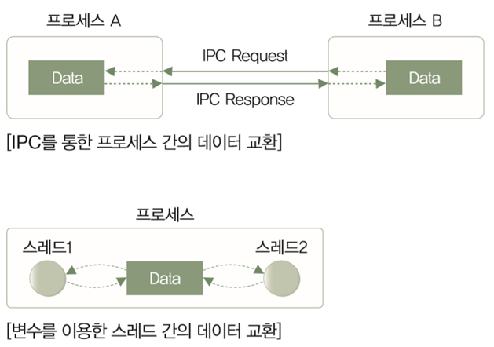
참조 : 멀티 프로세스 / 멀티 스레드 구조 프로그램 자원 공유

---


### 멀티 스레드 구조 프로그램 단점
1. <b>구현이 까다로움, 디버깅도 쉽지 않음</b>
2. 자식 스레드 중 하나에 문제가 생기면 <b>전체</b> 프로세스가 영향을 받음
3. 스레드를 너무 많이 사용하면 오히려 성능이 저하됨. 실제 일을 하는 시간에 비해 <b>작업간 전환 Context Switching</b>으로 인한 시간이 커져 성능이 저하.
<br>
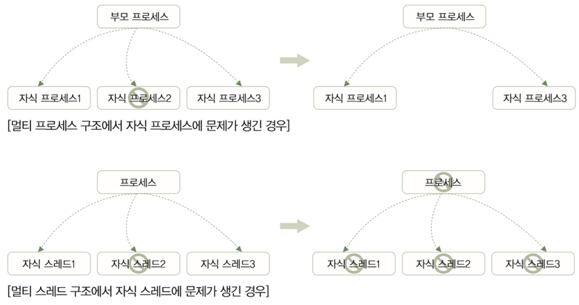
참조 : 멀티 프로세스 / 멀티 스레드 구조 자식 문제

---

### 정리
- <b>멀티 프로세스</b> ~ 소프트웨어의 안정성
- <b>멀티 스레드</b> ~ 초고성능의 사양

<br><br>
## 19.1.1 스레드 시작하기
- System.Threading.Thread 클래스 사용


```C#
static void DoSomething() // 스레드가 실행할 메소드
{
    for (int i = 0; i < 5; i++)
    {
        Console.WriteLine("DoSomething : {0}", i);
    }
}

static void Main(string[] args)
{
    Thread t1 = new Thread(new ThreadStart(DoSomething)); 1. Thread의 인스턴스 생성
    
    t1.Start(); // 2. 스레드 시작
    
    t1.Join(); // 3. 스레드의 종료 대기
}
```
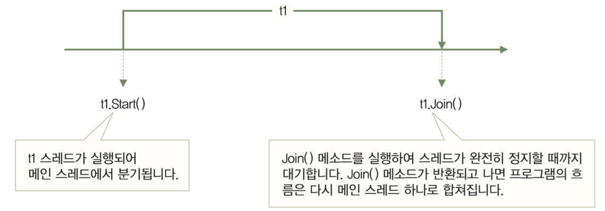

- t1.Start()를 호출하는 시점 : CLR이 실제 스레드를 생성, 즉 메모리에 적재되는 시점


---

<details>
<summary> <b>예제 : BasicThread </summary></b>
<div>

```C#
using System;
using System.Threading;

namespace BasicThread
{
    class MainApp
    {
        static void DoSomething()
        {
            for (int i = 0; i < 5; i++)
            {
                Console.WriteLine($"DoSomething : {i}");
                Thread.Sleep(10);
            }
        }

        static void Main(string[] args)
        {            
            Thread t1 = new Thread(new ThreadStart(DoSomething));

            Console.WriteLine("Starting thread...");
            t1.Start();

            for (int i = 0; i < 5; i++)
            {
                Console.WriteLine($"Main : {i}");
                Thread.Sleep(10); // ★ 다른 스레드도 CPU를 사용할 수 있도록 CPU 점유를 내려놓음. ms(1,000ms=1s) 단위★
            }
            
            Console.WriteLine("Wating until thread stops...");
            t1.Join();

            Console.WriteLine("Finished");
        }
    }
}

```
결과
```cmd
Starting thread...
Main : 0
DoSomething : 0
DoSomething : 1
Main : 1
Main : 2
DoSomething : 2
DoSomething : 3
Main : 3
Main : 4
DoSomething : 4
Wating until thread stops...
Finished
```


</div></details>

---

#### 결론
- 스레드를 생성 후 .start()로 호출 시 바로 실행되는 것이 아니고, 실행 대기열에 저장되어 자신의 차례가 될 때까지 기다림
- 현재의 경우 t1스레드가 실행 대기열에 저장되는 시간이 걸려 main 스레드가 실행이 먼저
- 10ms동안 실행할 수 있는 결과가 계속 달라져서, 결과는 항상 같지 않음.

<br>

참조 : 스레드 실행 과정

<br><br>


## 19.1.2 스레드 임의로 종료시키기

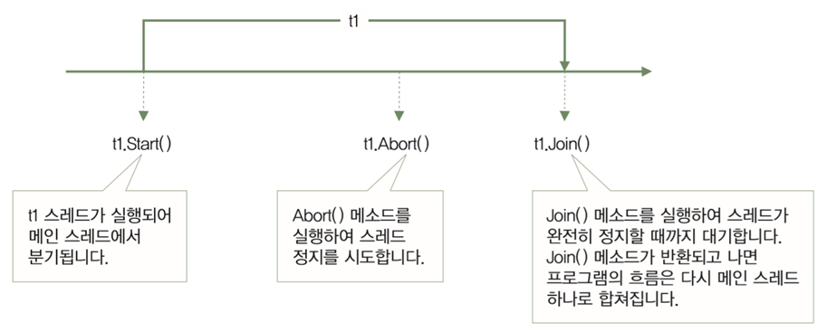

- Abort() 메소드 호출 시 실행 중이던 코드에 ThreadAbortException 호출.
- catch로 예외 처리하는 부분도 생각해야 함
- <b>.Abort() 권장 X</b> : 어떤 자원을 잠근 후 자원을 해제하지 못한 채 끝나면, 다른 스레드들은 접근 불가능

---

<details>
<summary> <b>예제 : AbortingThread </summary></b>
<div>

```C#
using System;
using System.Threading;

namespace AbortingThread
{
    class SideTask
    {
        int count;

        public SideTask(int count)
        {
            this.count = count;
        }

        public void KeepAlive()
        {
            try
            {
                while (count > 0)
                {
                    Console.WriteLine($"{count--} left");
                    Thread.Sleep(10);
                }
                Console.WriteLine("Count : 0");
            }
            catch (ThreadAbortException e)
            {
                Console.WriteLine(e);
                Thread.ResetAbort();
            }
            finally
            {
                Console.WriteLine("Clearing resource...");
            }
        }
    }

    class MainApp
    {
        static void Main(string[] args)
        {
            SideTask task = new SideTask(100);
            Thread t1 = new Thread(new ThreadStart(task.KeepAlive));
            t1.IsBackground = false;

            Console.WriteLine("Starting thread...");
            t1.Start();

            Thread.Sleep(100);

            Console.WriteLine("Aborting thread...");
            t1.Abort();

            Console.WriteLine("Wating until thread stops...");
            t1.Join();

            Console.WriteLine("Finished");
        }
    }
}

```
결과
```cmd
Starting thread...
100 left
99 left
98 left
97 left
96 left
95 left
94 left
Aborting thread...
System.Threading.ThreadAbortException: 스레드가 중단되었습니다.
   위치: System.Threading.Thread.SleepInternal(Int32 millisecondsTimeout)
   위치: System.Threading.Thread.Sleep(Int32 millisecondsTimeout)
   위치: AbortingThread.SideTask.KeepAlive() 파일 C:\Users\Affinity\source\repos\ConsoleApp7\ConsoleApp7\Program.cs:줄 22
Wating until thread stops...
Clearing resource...
Finished
```

</div></details>

---

#### 결론
- 결과는 항상 같지 않음. (종료되는 counting은 90 초반에서 계속 변경)
- finally문은 스레드문이 끝나기 전 실행

<br><br>

## 19.1.3 스레드의 일생과 상태 변화
- ThreadState 열거형 -> <b>반드시 ★비트 연산★</b>
- 동시에 2개 이상의 상태를 가질 수 있음
- Flags 특성 (열거형을 비트 필드로 처리, 요소들의 집합으로 구성되는 값도 표현 가능)
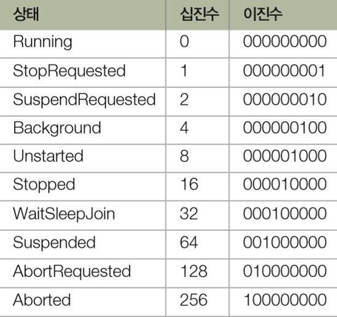

<br><br>

### 스레드 상태 간의 관계
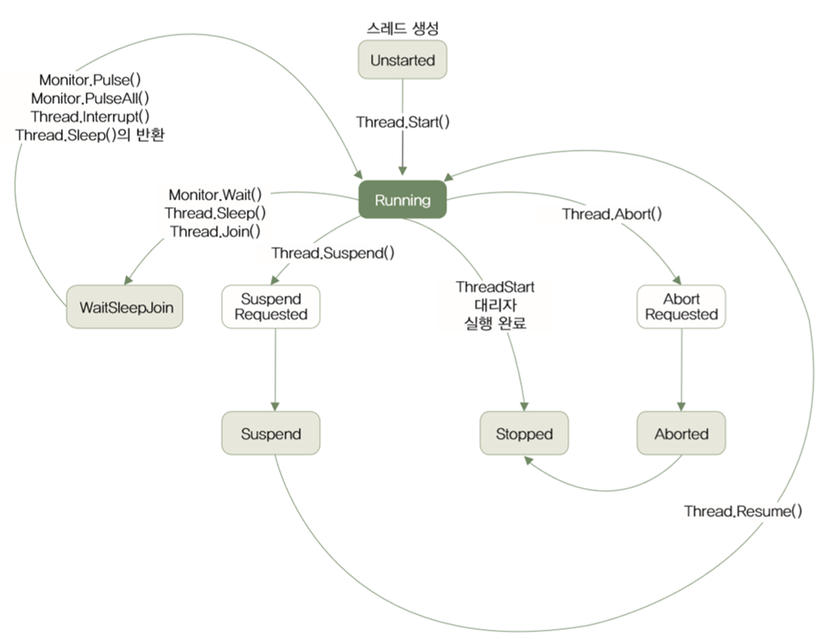

cf. Background 속성
  * <b>(default) False -> Foreground </b>: 메인 스레드가 종료되어도 foreground가 살아있는 한 프로세스가 종료되지 않고 실행
  * <b>Background</b> : 메인 스레드가 종료되면, 바로 프로세스를 종료

---

<details>
<summary> <b>예제 : UsingThreadState </summary></b>
<div>

```C#
using System;
using System.Threading;

namespace UsingThreadState
{
    class MainApp
    {
        private static void PrintThreadState(ThreadState state)
        {
            Console.WriteLine("{0,-16} : {1}", state, (int)state);
        }

        static void Mainstring[] args)
        {
            PrintThreadState(ThreadState.Running);

            PrintThreadState(ThreadState.StopRequested);

            PrintThreadState(ThreadState.SuspendRequested);

            PrintThreadState(ThreadState.Background);

            PrintThreadState(ThreadState.Unstarted);

            PrintThreadState(ThreadState.Stopped);

            PrintThreadState(ThreadState.WaitSleepJoin);

            PrintThreadState(ThreadState.Suspended);

            PrintThreadState(ThreadState.AbortRequested);

            PrintThreadState(ThreadState.Aborted);

            PrintThreadState(ThreadState.Aborted | ThreadState.Stopped);  // 비트 연산
        }
    }
}


```
결과
```cmd
Running          : 0
StopRequested    : 1
SuspendRequested : 2
Background       : 4
Unstarted        : 8
Stopped          : 16
WaitSleepJoin    : 32
Suspended        : 64
AbortRequested   : 128
Aborted          : 256
Stopped, Aborted : 272
```

</div></details>

---

<br><br>

## 19.1.4 인터럽트 : 스레드를 임의로 멈추는 또 다른 방법
- Interrupt() 메서드 : 스레드가 WaitJoinSleep 상태면, ThreadInterruptedException 예외를 던져 스레드를 중지시킴
- Abort()와의 차이점 : 스레드가 Running 상태일 땐 <b>WaitJoinSleep 상태가 될 때까지 기다려줌</b>
- -> 코드가 절대로 중단되면 안 되는 작업을 하고 있을 때에는 중단되지 않는다는 보장을 받을 수 있음

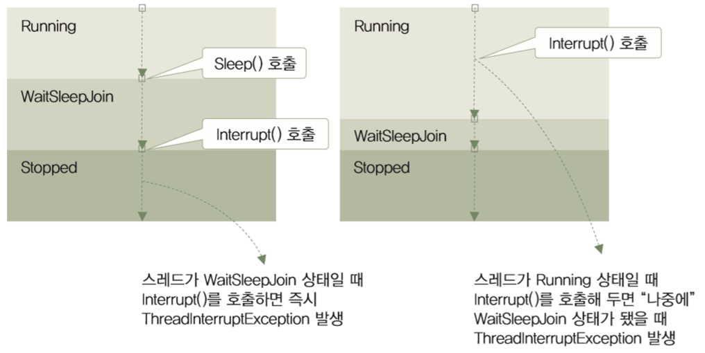

---

<details>
<summary> <b>예제 : InterruptingThread </summary></b>
<div>

```C#
using System;
using System.Security.Permissions;
using System.Threading;

namespace InterruptingThread
{
    class SideTask
    {
        int count;

        public SideTask(int count)
        {
            this.count = count;
        }

        public void KeepAlive()
        {
            try
            {
                Console.WriteLine("Running thread isn't gonna be interrupted");
                Thread.SpinWait(1000000000); // Sleep 메서드와 비슷하게 대기하게 하지만, 스레드가 Running 상태를 유지하게 함.
                // Inturupt() 메소드가 호출 되었을 때 Running 상태로 유지하도록 하기 위해 사용

                while (count > 0)
                {
                    Console.WriteLine($"{count--} left");

                    Console.WriteLine("Entering into WaitJoinSleep State...");
                    Thread.Sleep(10);
                }
                Console.WriteLine("Count : 0");
            }
            catch (ThreadInterruptedException e)
            {
                Console.WriteLine(e);
            }
            finally
            {
                Console.WriteLine("Clearing resource...");
            }
        }
    }

    class MainApp
    {
        static void Main(string[] args)
        {
            SideTask task = new SideTask(100);
            Thread t1 = new Thread(new ThreadStart(task.KeepAlive));
            t1.IsBackground = false;

            Console.WriteLine("Starting thread...");
            t1.Start();

            Thread.Sleep(100);

            Console.WriteLine("Interrupting thread...");
            t1.Interrupt();

            Console.WriteLine("Waitng until thread stops...");
            t1.Join();

            Console.WriteLine("Finished");
        }
    }
}


```
결과
```cmd
Starting thread...
Running thread isn't gonna be interrupted
Interrupting thread...
Waitng until thread stops...
100 left
Entering into WaitJoinSleep State...
System.Threading.ThreadInterruptedException: 스레드가 대기 상태에서 인터럽트되었습니다.
   위치: System.Threading.Thread.SleepInternal(Int32 millisecondsTimeout)
   위치: System.Threading.Thread.Sleep(Int32 millisecondsTimeout)
   위치: InterruptingThread.SideTask.KeepAlive() 파일 C:\Users\Affinity\source\repos\ConsoleApp7\ConsoleApp7\Program.cs:줄 28
Clearing resource...
Finished

```
cf. System.Threading.SpinWait : 커널 이벤트에 필요한 비용이 많이 드는 컨텍스트 스위치 및 커널 전환을 방지하기 위해 하위 수준 시나리오에서 사용할 수 있는 단순한 동기화 유형.(https://docs.microsoft.com/ko-kr/dotnet/standard/threading/spinwait)
</div></details>

---

### 결론
- main스레드의 .Intrrupt, "Waiting~" 까지 실행된 이후(.Join() 이전), t1의 while문이 실행됨

<br><br>

## 19.1.5 스레드 간의 동기화
- <b>동기화 (Synchronization)</b> : 스레드들이 순서를 갖춰 자원을 사용하게 하는 것.


### 1. lock키워드로 동기화하기

---

- 크리티컬 섹션(Critical Section) : 한 번에 한 스레드만 사용할 수 있는 코드 영역

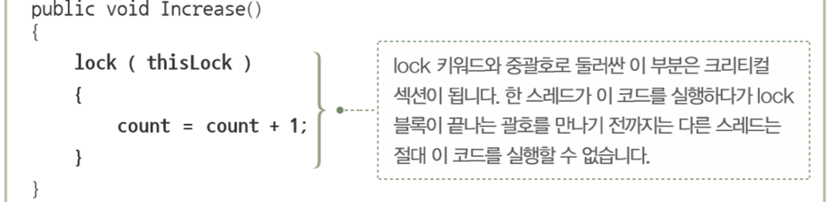

- lock 키워드의 매개변수 : <b>참조형</b>
#### ※ 주의 : this, Type, string 형식 사용 자제
ex) lock(this) 
- 스레드가 끝나기 전 까지 해당 클래스는 타 스레드에서 사용 불가
- 불필요하게 객체 전체 범위에 lock을 걸어 다수 메서드가 공유 리소스를 접근하는데 Lock Granularity (잠김 단위) 떨어트리는 효과
- 외부에서 해당 클래스를 lock 한 후, 그 객체 안에서 메서드를 호출 + 그 메서드 안에 lock(this)를 하는 경우에는 외부의 lock을 메서드 내에서 기다리다가 Deadlock(교착상태) 발생 가능

<b> --> 필요한 부분만 Locking한다는 원칙에 의해, Critical Section 코드를 범위를 작게 하기를 권장 (아닐 시, 성능의 저하 생김)</b>
<br><br>

---

<details>
<summary> <b>예제 : Synchronize </summary></b>
<div>

```C#
using System;
using System.Threading;

namespace Synchronize
{
    class Counter
    {
        const int LOOP_COUNT = 1000;

        readonly object thisLock;

        private int count;
        public int Count
        {
            get { return count; }
        }

        public Counter()
        {
            thisLock = new object();
            count = 0;
        }

        public void Increment()
        {
            int loopCount = LOOP_COUNT;
            while (loopCount-- > 0)
            {
                lock (thisLock)
                {
                    count++;
                }
                Thread.Sleep(1);
            }
        }

        public void Decrement()
        {
            int loopCount = LOOP_COUNT;
            while (loopCount-- > 0)
            {
                lock (thisLock)
                {
                    count--;
                }
                Thread.Sleep(1);
            }
        }
    }

    class MainApp
    {
        static void Main(string[] args)
        {
            Counter counter = new Counter();

            Thread incThread = new Thread(
                new ThreadStart(counter.Increment));
            Thread decThread = new Thread(
                new ThreadStart(counter.Decrement));

            incThread.Start();
            decThread.Start();

            incThread.Join();
            decThread.Join();

            Console.WriteLine(counter.Count);
        }
    }
}


```
결과 : 0

```cmd
0
```
</div></details>


<details>
<summary> <b>cf. lock문 해제 후 출력 </summary></b>
<div>
    
```cmd
I1 D0 I1 D0 I1 D0 D-1 I0 I0 D0 I1 D0 I1 D0 D-1 I0 D-1 I-1 I0 D-1 I-1 D-2 I-1 D-1 I0 D-1 I0 D-1 I0 D-1 I0 D-1 I0 D-1 I0 D-1 D-2 I-1 D-2 I-1 D-1 I0 I0 D-1 I0 D-1 I0 D-1 I0 D-1 I0 D-1 I0 D-1 I0 D-1 I0 D-1 I-1 D-1 D-2 I-1 I0 D-1 I0 D-1 I0 D-1 D-2 I-1 I0 D-1 I0 D-1 I0 D-1 D0 I0 I0 D0 D-1 I0 I1 D0 D0 I1 I1 D0 I1 D0 D-1 I0 I1 D0 D-1 I0 I1 D1 I2 D1 D0 I1 I2 D1 I2 D1 I2 D1 I2 D1 D0 I1 D1 I1 I2 D1 I2 D1 D0 I1 I2 D1 D0 I1 I2 D1 I2 D1 I1 D0 D0 I1 I2 D1 I2 D1 I2 D1 I1 D1 I1 D0 I2 D1 I2 D1 I2 D1 I2 D1 I2 D1 I2 D1 I2 D1 I2 D1 I2 D1 I2 D1 I2 D1 I2 D1 I2 D1 I2 D1 I2 D1 I2 D1 I2 D1 I2 D1 I2 D1 I2 D1 I2 D1 I2 D1 I2 D1 I2 D1 I2 D1 I2 D1 I2 D1 I2 D1 I2 I3 D2 I3 D2 I3 D2 I3 D2 I2 D1 D1 I2 I3 D2 D2 I2 I3 D2 I3 D2 D1 I2 D2 I3 D1 I2 I3 D2 I3 D2 I3 D2 D2 I3 I3 D2 D1 I2 D1 I2 I3 D2 I3 D2 I3 D2 I3 D2 D1 I2 I3 D2 I3 D2 D2 I3 D1 I2 D1 I2 D1 I2 D1 I2 D1 I2 D1 I2 D1 I2 D1 I2 D1 I2 D1 I2 D1 I2 D1 I2 D1 I2 D1 I2 D1 I2 D1 I2 D1 I2 D1 D1 I2 I2 D1 D0 I1 I2 D1 I2 D1 I2 D1 I2 D1 I2 D1 I2 D1 I2 D1 I2 D1 I2 D1 I2 D1 I2 D1 I2 D1 I2 D1 I1 D0 I2 D1 I2 D1 I2 D1 I2 D1 I2 D1 I2 D1 I2 D1 I2 D1 D1 I1 D0 I1 D0 I1 D0 I1 D0 I1 D0 I1 D0 I1 D0 I1 D0 I1 D0 I1 D0 D-1 I0 I1 D0 I1 D0 I1 D0 I1 D0 I1 D0 I1 D0 I1 D0 D-1 I0 I1 D0 I1 D0 I1 D0 I1 D0 I1 D0 I1 D0 I1 D0 I1 D0 I1 D0 D-1 I0 I1 D0 D-1 I0 I1 D0 D-1 I0 I1 D0 I1 D0 I1 D0 I1 D0 I1 D0 I1 D0 I1 D0 I1 D0 I0 D0 I1 D0 I1 D0 I1 D0 I1 D0 I1 D0 I1 D0 D-1 I0 I1 D0 D-1 I0 D-1 I0 D-1 I0 D-1 I0 D-1 I0 D-1 D-2 I-1 I0 D-1 I0 D-1 I0 D-1 I0 D-1 D-2 I-1 I0 D-1 I0 D-1 I0 D-1 D-1 I0 D-1 I-1 D-2 I-1 D-2 I-1 D-2 I-1 D-2 I-1 D-2 I-1 D-2 I-1 D-2 I-1 D-2 I-1 D-2 I-1 D-2 I-1 D-2 I-1 D-2 I-1 D-2 I-1 D-2 I-1 D-2 I-1 D-2 I-1 D-2 I-1 D-2 I-1 D-2 I-1 D-2 I-1 D-2 I-1 D-2 I-1 D-2 I-1 I0 D-1 I0 D-1 D-2 I-1 D-2 I-1 D-2 I-1 D-2 I-1 D-2 I-1 D-2 I-1 D-2 I-1 D-2 I-1 D-2 I-1 D-2 I-1 D-2 I-1 D-2 I-1 D-2 I-1 D-2 I-1 D-2 I-1 D-2 I-1 D-2 I-1 D-2 I-1 D-2 I-1 D-2 I-1 D-2 I-1 D-2 I-1 D-2 I-1 D-2 I-1 D-2 I-1 D-2 I-1 D-2 I-1 D-2 I-1 D-2 I-1 D-2 I-1 I0 D-1 I0 D-1 D-2 I-1 D-2 I-1 D-2 I-1 D-2 I-1 D-2 I-1 D-2 I-1 D-2 I-1 D-2 I-1 I0 D-1 D-2 I-1 I0 D-1 D-1 I0 D-1 I-1 I0 D-1 D-2 I-1 I0 D-1 D-1 I0 I0 D-1 I0 D-1 I0 D-1 I0 D-1 I0 D-1 I0 D-1 I0 D-1 I0 D-1 D-1 I-1 I0 D-1 D-1 I0 D-2 I-1 D-2 I-1 I0 D-1 D-2 I-1 I0 D-1 D-2 I-1 D-1 I0 D-2 I-1 D-2 D-2 I-2 I-1 D-2 D-3 I-2 D-2 I-2 I-2 D-2 I-1 D-2 I-1 I0 D-1 I0 D-1 I0 I1 D0 I1 D0 I1 D0 I1 D0 I1 I2 D1 D0 I1 I2 D1 I2 D1 I2 D1 I2 D1 I2 D1 I2 D1 I2 I3 D2 D2 I2 D2 I3 I2 D2 D1 I2 I3 D2 D1 I2 D1 I2 I3 D2 D1 I2 I2 D2 I3 D2 I3 D2 I3 D2 I3 D2 I3 D2 I3 D2 I3 D2 I3 D2 I3 D2 I3 D2 D1 I2 D1 I2 D1 I2 D1 I2 D1 I2 D1 I2 D1 I2 D1 I2 D1 I2 D1 I2 D1 I2 D1 I2 D1 I2 D1 I2 D1 I2 D1 I2 I3 D2 I3 D2 I2 D2 D1 I2 I3 D2 D1 I2 D1 I2 D1 I2 D1 I2 D1 I2 D1 I2 D1 I2 D1 I2 D1 I2 D1 I2 D1 I2 D1 I2 D1 I2 D1 I2 D1 I2 D1 I2 D1 I2 D1 I2 D1 I2 D1 I2 D1 I2 D1 I2 D1 I2 D1 I2 D1 I2 D1 I2 D1 I2 D1 I2 D1 I2 D1 I2 D1 I2 D1 I2 D1 I2 D2 I3 D1 I2 D1 I2 D1 I2 D2 I2 D1 I2 D1 I2 D1 I2 D1 I2 D1 I2 D1 I2 D1 I2 D1 I2 D1 I2 D2 I2 D1 I2 D1 I2 D1 I2 D1 I2 D1 D0 I1 D0 I1 D0 I1 D0 I1 D0 I1 D0 I1 D0 D-1 I0 I1 D0 D-1 I0 D-1 D-2 I-1 D-2 I-1 D-2 I-1 D-2 I-1 D0 I0 D-1 I0 D-1 I0 D-1 I0 D-1 I0 D-1 I0 D-1 I0 D-1 I0 D-1 I0 D0 I0 D0 I0 I1 D0 D0 I1 D-1 I0 I1 D0 D-1 I0 I0 D0 I1 D-1 I0 D-1 D-2 I-1 D-2 I-1 D-2 D-3 I-2 I-1 D-2 D-3 I-2 I-1 D-2 D-3 I-2 I-1 D-1 I0 D-1 I0 D-1 I0 D-1 I0 D-1 D-2 I-1 D-2 I-1 D-2 I-1 D-2 I-1 D-2 I-1 D-2 I-1 D-2 I-1 I0 D-1 I0 D-1 I0 D-1 I0 D-1 I0 D-1 I0 I1 D0 I1 D0 I1 D0 I1 D0 I1 D0 I1 I2 D1 D0 I1 D0 I1 D0 I1 D0 I0 D-1 I0 D-1 I0 D-1 I0 D-1 I0 D-1 I0 D-1 I0 I1 D0 D-1 I0 I1 D0 D-1 I0 D-1 I0 D-1 I0 D-1 I0 I1 D0 D-1 I0 D-1 I0 D-1 I0 D1 I1 I2 D1 D1 I2 I2 D1 I2 D1 D1 I2 I2 D1 I2 D1 I2 D1 D1 I1 I2 D2 I3 D2 D1 I2 I3 D2 D1 I2 D3 I3 D2 I3 I3 D2 I4 D3 D2 I3 I4 D3 I4 D3 I4 D3 I4 D3 I4 D5 I5 D4 I5 D4 I5 D4 I5 D4 I5 D4 I5 D4 I5 D4 I5 D4 I5 D4 I5 D4 I5 D4 D3 I4 I5 D4 D3 I4 I5 D4 I5 D4 D3 I4 D3 I4 D3 I4 D3 I4 D3 I4 D3 I4 D3 I4 D3 I4 D3 I4 D3 I4 D3 I4 D3 I4 D3 I4 D3 I4 D3 I4 D3 I4 D3 D2 I3 I4 D3 I4 D3 D2 I3 D3 I4 I4 D3 D2 I3 I3 D3 D2 I3 I4 D3 D2 I3 I4 D3 D2 I3 D2 I3 I4 D3 I4 D3 I4 D3 I4 I5 D4 D3 I4 D3 I4 D3 I4 D3 I4 D3 I4 D3 I4 D3 I4 D3 I4 D3 I4 D3 I4 D3 I4 D3 I4 D3 I4 D3 I4 D4 I5 D3 I4 D3 I4 D3 D2 I3 D2 I3 D2 D2 I2 D1 I2 D1 I2 I3 D2 D1 I2 D1 I2 D1 I2 D1 I2 D1 I2 D1 I2 I2 D1 I2 D1 I3 D2 I3 D2 I3 D2 I3 D2 I3 D2 I3 D2 I3 D2 I3 I3 D3 D2 I2 I3 D2 D2 I2 I3 D2 D1 I2 D1 I2 D1 I2 D1 I2 D1 I2 D1 I2 D1 I2 D1 I2 D1 I2 D1 I2 D1 I2 D1 I2 D1 I2 D1 D0 I1 I2 D1 D0 I1 D0 I1 D0 I1 D0 I1 D0 I1 D0 I1 D0 I1 D0 I1 D0 I1 I2 D1 D0 I1 D1 I2 I2 D1 I2 D1 I2 D1 I2 I3 D2 I3 D2 I2 D2 I3 D2 I3 D2 I3 D2 I3 D2 I3 D2 I3 D2 I3 D2 I3 D2 I3 I4 D3 I4 D3 I4 D3 I4 D3 I4 D3 I4 D3 I4 D3 I4 D3 I4 D3 I4 D3 I4 D3 I4 D3 I4 D3 I4 D3 I4 D3 I4 D3 I4 D3 D2 I3 D2 I3 D2 I3 I4 D4 D3 I4 D3 I4 I5 D4 D3 I4 D3 I4 D3 I4 D3 I4 D3 I4 D3 I4 D3 I4 D3 I4 D3 I4 D3 I4 D3 I4 D3 I4 D3 I4 D3 I4 D3 I4 D3 I4 D3 I4 D3 I4 D3 I4 D3 I4 D3 I4 D3 I4 D3 I4 D3 I4 D3 I4 D3 I4 D3 I4 D3 I4 D3 I4 D3 I4 D3 I4 D3 I4 D3 I4 D3 I4 D3 D2 I3 D2 I3 D2 I3 I4 D3 D2 I3 D2 I3 D2 I3 D3 I3 D2 I3 D2 I3 D2 D1 I2 D1 I2 D1 I2 I2 D1 I3 D2 I3 D2 I3 D2 D1 I2 D1 I2 D1 I2 D1 I2 D1 I2 D1 I2 D1 I2 D1 I2 D1 I2 D1 I2 D1 I2 D1 I2 D1 I2 D1 I2 D1 I2 D1 I2 D1 I2 D1 I2 D1 I2 D1 I2 D1 I2 D1 I2 D1 I2 D1 I2 D1 I2 D1 I2 D1 I2 D1 I2 D1 I2 D1 I2 D1 I2 D1 D0 I1 D0 I1 D0 I0 I1 D0 D-1 I0 D-1 I0 D-1 I0 D-1 I0 D-1 I0 I1 D0 D0 I1 D-1 I0 I1 D0 D-1 I0 D-1 I0 I1 D0 I1 D0 I1 D0 I1 D0 I1 I1 D1 I1 D1 I2 D1 I2 D1 I2 D1 I2 D1 I2 D1 I2 D1 I2 D1 I2 D1 I2 D1 I2 D1 I2 D1 I2 D1 I2 D1 D0 I1 I2 D1 D0 I1 I2 D1 D0 I1 I2 D1 D0 I1 I2 D1 I2 D1 I2 D1 I2 D1 I2 D1 I2 D1 I2 D1 I2 D1 I2 D1 I2 I3 D2 D1 I2 I3 D2 D1 I2 D1 I2 D1 I2 I3 D2 I3 D2 D2 I3 I3 D2 I3 D2 I3 D2 I3 D2 I3 D2 D1 I2 I3 D2 I3 D2 I3 D2 D1 I2 D1 I2 D1 I2 I3 D2 D2 I3 I3 D2 D1 I2 D1 I2 I3 D2 D1 I2 D1 I2 I3 D2 D1 I2 I3 D2 D2 I3 D1 I2 D1 I2 D1 I2 D1 I2 D1 I2 D1 I2 D1 I2 D1 I2 D1 I2 D1 I2 D1 I2 D1 I2 D1 I2 D1 I2 D1 I2 D1 I2 D1 I2 D1 I2 D1 I2 D1 I2 D1 I2 D1 I2 I3 D2 D1 I2 D2 I2 I3 D2 D1 I2 I3 D2 I3 D2 I3 D2 I3 D2 I3 D2 I3 D2 I3 D2 I3 D2 I3 D2 I3 D2 I3 D2 I3 D2 I3 D2 I3 D2 I3 D2 I3 D2 I3 D2 I3 I4 D3 D2 I3 I4 D3 I4 D3 I4 D3 D2 I3 I4 D3 I4 D3 D2 I3 I3 D3 D2 I3 I4 D3 D2 I3 D2 I3 D2 I3 D2 I3 D2 I3 D2 I3 D2 I3 D2 I3 D2 I3 D2 I3 D2 D1 I2 D1 I2 D1 I2 D1 I2 D1 I1 D1 D1 I1 D0 I1 D0 I1 D0 I1 D0 I1 I1 D1 D0 I1 I2 D1 D0 I1 D0 I1 D0 I1 D0 I1 D0 I1 D0 I1 D0 I1 D0 I1 D0 I1 I2 D1 D0 I1 I2 D1 I2 D1 I2 D1 I2 D1 I2 D1 I2 D1 I2 I3 D2 D1 I2 I3 D2 I3 D2 I3 D2 I3 D2 I3 D2 D1 I2 D1 I2 I3 D2 I2 D1 I3 D2 I3 D2 D1 I2 I3 I4
```

cf. 또 한 번 다르게 실행, 이번엔 loopCount 출력

```cmd
I999 D999 D998 I998 I997 D997 I996 D996 I995 D995 I994 D994 I993 D993 I992 D992 I991 D991 I990 D990 I989 D989 I988 D988 I987 D987 I986 D986 I985 D985 I984 D984 I983 D983 I982 D982 I981 D981 I980 D980 I979 D979 I978 D978 I977 D977 I976 D976 I975 D975 I974 D974 I973 D973 I972 D972 I971 D971 I970 D970 I969 D969 I968 D968 I967 D967 I966 D966 I965 D965 I964 D964 D963 I963 D962 I962 D961 I961 D960 I960 D959 I959 D958 I958 D957 I957 D956 D955 I956 I955 D954 I954 D953 I953 D952 I952 D951 D950 I951 I950 D949 D948 I949 D947 I948 I947 D946 I946 D945 I945 D944 D943 I944 I943 D942 D941 I942 I941 D940 I940 D939 I939 D938 I938 D937 I937 D936 I936 D935 I935 D934 I934 D933 I933 D932 I932 D931 I931 D930 I930 D929 I929 D928 I928 D927 I927 D926 I926 D925 I925 D924 I924 I923 D923 I922 D922 I921 D921 I920 D920 I919 D919 I918 D918 I917 D917 I916 D916 I915 D915 I914 D914 I913 D913 I912 D912 I911 D911 I910 D910 I909 D909 I908 D908 I907 D907 I906 D906 I905 D905 I904 D904 I903 D903 I902 I901 D902 I900 D901 I899 D900 I898 D899 I897 D898 I896 D897 I895 D896 I894 I893 D895 I892 D894 I891 D893 I890 D892 D891 I889 D890 I888 D889 I887 D888 I886 I885 D887 I884 D886 I883 D885 D884 I882 D883 I881 D882 I880 D881 I879 D880 I878 D879 I877 I876 D878 I875 D877 D876 I874 I873 D875 I872 D874 I871 D873 I870 D872 D871 I869 I868 D870 D869 I867 D868 I866 D867 I865 D866 I864 D865 I863 D864 I862 D863 I861 D862 I860 I859 D861 I858 D860 I857 D859 I856 D858 I855 D857 I854 D856 I853 D855 I852 D854 I851 D853 I850 D852 I849 D851 I848 I847 D850 D849 I846 D848 I845 D847 I844 D846 I843 D845 I842 D844 I841 D843 I840 D842 I839 D841 I838 D840 I837 D839 I836 D838 I835 D837 I834 D836 I833 D835 I832 D834 I831 D833 I830 D832 I829 D831 I828 D830 I827 D829 D828 I826 D827 I825 D826 I824 D825 I823 D824 I822 D823 I821 D822 I820 I819 D821 I818 D820 I817 D819 I816 D818 I815 D817 I814 D816 I813 D815 I812 D814 I811 D813 I810 D812 I809 D811 I808 D810 I807 D809 I806 D808 I805 D807 I804 D806 I803 D805 I802 D804 I801 D803 I800 D802 I799 D801 I798 D800 I797 D799 I796 D798 I795 D797 I794 I793 D796 D795 I792 D794 I791 D793 I790 D792 I789 D791 D790 I788 I787 D789 D788 I786 D787 I785 I784 D786 I783 D785 D784 I782 I781 D783 I780 D782 D781 I779 I778 D780 D779 I777 D778 I776 I775 D777 I774 D776 D775 I773 D774 I772 I771 D773 D772 I770 I769 D771 D770 I768 D769 I767 D768 I766 I765 D767 D766 I764 I763 D765 I762 D764 I761 D763 I760 D762 I759 D761 I758 D760 I757 D759 I756 D758 I755 D757 I754 D756 I753 D755 I752 D754 I751 D753 I750 D752 I749 D751 I748 D750 I747 D749 I746 I745 D748 D747 I744 I743 D746 D745 I742 I741 D744 I740 D743 D742 I739 I738 D741 D740 I737 D739 I736 I735 D738 I734 D737 D736 I733 D735 I732 D734 I731 D733 I730 D732 I729 D731 I728 D730 I727 D729 I726 D728 I725 D727 I724 D726 I723 D725 D724 I722 I721 D723 I720 D722 I719 D721 I718 D720 I717 D719 I716 D718 D717 I715 D716 I714 D715 I713 D714 I712 D713 I711 D712 D711 I710 I709 D710 I708 D709 I707 D708 I706 D707 I705 D706 D705 I704 D704 I703 D703 I702 D702 I701 D701 I700 I699 D700 D699 I698 D698 I697 D697 I696 D696 I695 D695 I694 D694 I693 D693 I692 I691 D692 I690 D691 I689 D690 D689 I688 I687 D688 I686 D687 I685 D686 I684 D685 I683 D684 I682 D683 I681 D682 I680 D681 I679 D680 I678 D679 I677 D678 I676 D677 I675 D676 I674 D675 I673 D674 D673 I672 I671 D672 D671 I670 D670 I669 I668 D669 D668 I667 I666 D667 D666 I665 D665 I664 I663 D664 I662 D663 I661 D662 D661 I660 D660 I659 D659 I658 D658 I657 D657 I656 D656 I655 D655 I654 D654 I653 D653 D652 I652 I651 D651 I650 D650 I649 D649 I648 D648 I647 D647 I646 D646 I645 D645 I644 D644 I643 D643 I642 D642 D641 I641 I640 D640 I639 D639 D638 I638 D637 I637 D636 I636 D635 I635 D634 I634 D633 I633 I632 D632 I631 D631 D630 I630 I629 D629 I628 D628 I627 D627 I626 D626 I625 D625 I624 D624 I623 D623 I622 D622 I621 I620 D621 I619 D620 D619 I618 D618 I617 D617 I616 I615 D616 I614 D615 I613 D614 I612 D613 D612 I611 I610 D611 I609 D610 I608 D609 I607 D608 I606 D607 I605 D606 I604 D605 I603 D604 I602 D603 I601 D602 I600 I599 D601 I598 D600 I597 D599 I596 D598 I595 D597 D596 I594 I593 D595 I592 D594 I591 D593 I590 D592 I589 D591 I588 D590 I587 D589 I586 D588 I585 D587 I584 D586 I583 D585 I582 D584 I581 D583 I580 D582 I579 D581 I578 I577 D580 I576 D579 I575 D578 I574 D577 I573 D576 I572 D575 I571 D574 I570 D573 I569 D572 I568 D571 I567 D570 I566 I565 D569 I564 D568 I563 D567 I562 D566 I561 D565 I560 D564 D563 I559 D562 I558 I557 D561 I556 D560 I555 D559 I554 D558 I553 D557 I552 D556 I551 D555 I550 D554 I549 I548 D553 I547 D552 I546 D551 I545 D550 I544 D549 I543 D548 I542 D547 I541 D546 I540 D545 I539 D544 I538 D543 I537 D542 I536 D541 I535 D540 I534 D539 I533 D538 I532 D537 I531 D536 I530 D535 I529 D534 I528 D533 I527 D532 I526 D531 I525 D530 I524 D529 I523 D528 I522 D527 I521 D526 I520 D525 I519 I518 D524 I517 D523 I516 D522 I515 D521 I514 D520 I513 D519 I512 D518 I511 D517 I510 D516 I509 D515 I508 D514 I507 D513 I506 D512 I505 D511 I504 D510 I503 D509 I502 D508 I501 I500 D507 I499 D506 I498 D505 I497 D504 I496 D503 I495 D502 I494 D501 I493 D500 I492 D499 I491 D498 I490 D497 I489 D496 I488 D495 I487 D494 I486 D493 I485 D492 I484 D491 I483 D490 I482 D489 I481 D488 I480 D487 I479 D486 I478 D485 I477 I476 D484 I475 D483 I474 D482 I473 D481 I472 D480 I471 D479 I470 D478 I469 D477 I468 D476 D475 I467 I466 D474 I465 D473 I464 D472 I463 D471 I462 D470 I461 D469 I460 D468 I459 D467 I458 D466 I457 I456 D465 I455 D464 I454 D463 I453 D462 I452 I451 D461 I450 D460 I449 D459 I448 D458 I447 D457 I446 D456 I445 D455 I444 D454 I443 D453 I442 D452 I441 D451 I440 D450 I439 D449 I438 D448 I437 D447 I436 D446 I435 D445 I434 D444 I433 D443 I432 D442 I431 D441 I430 D440 I429 D439 I428 D438 I427 D437 I426 D436 I425 D435 I424 D434 D433 I423 I422 D432 D431 I421 I420 D430 I419 D429 I418 D428 I417 D427 I416 D426 I415 D425 I414 D424 I413 D423 I412 D422 I411 D421 I410 I409 D420 I408 D419 I407 D418 I406 D417 I405 D416 I404 D415 I403 D414 I402 D413 D412 I401 D411 I400 D410 I399 D409 D408 I398 D407 I397 D406 I396 D405 I395 D404 I394 D403 I393 D402 I392 D401 I391 D400 I390 D399 I389 D398 I388 D397 I387 D396 I386 I385 D395 I384 D394 I383 D393 I382 D392 I381 D391 I380 D390 I379 I378 D389 I377 D388 I376 D387 I375 D386 I374 D385 I373 D384 I372 D383 I371 D382 I370 D381 I369 I368 D380 I367 D379 I366 D378 I365 D377 I364 D376 I363 D375 I362 D374 I361 D373 I360 D372 I359 D371 D370 I358 D369 I357 I356 D368 I355 D367 D366 I354 I353 D365 D364 I352 D363 I351 D362 I350 D361 I349 D360 I348 D359 I347 I346 D358 I345 D357 I344 D356 I343 D355 I342 D354 D353 I341 D352 I340 D351 I339 D350 I338 D349 I337 D348 I336 D347 I335 D346 I334 I333 D345 I332 D344 I331 D343 I330 D342 I329 D341 I328 D340 I327 D339 I326 D338 I325 D337 I324 D336 I323 D335 I322 D334 I321 D333 I320 I319 D332 I318 D331 D330 I317 I316 D329 I315 D328 I314 D327 I313 D326 D325 I312 I311 D324 I310 D323 D322 I309 I308 D321 I307 D320 I306 D319 I305 D318 I304 D317 D316 I303 I302 D315 D314 I301 D313 I300 I299 D312 D311 I298 I297 D310 D309 I296 I295 D308 D307 I294 I293 D306 I292 D305 I291 D304 I290 D303 I289 D302 I288 D301 I287 D300 I286 D299 I285 D298 I284 D297 I283 D296 I282 D295 I281 D294 I280 D293 I279 D292 I278 D291 I277 D290 I276 D289 I275 D288 I274 D287 I273 D286 I272 D285 I271 D284 I270 D283 I269 D282 I268 D281 I267 D280 I266 D279 I265 D278 I264 D277 I263 D276 I262 D275 I261 D274 I260 D273 I259 D272 I258 D271 I257 D270 I256 D269 I255 D268 D267 I254 I253 D266 I252 D265 I251 D264 I250 D263 I249 D262 I248 D261 I247 D260 I246 D259 I245 D258 I244 D257 I243 D256 I242 D255 I241 D254 I240 D253 I239 D252 I238 D251 I237 D250 I236 D249 I235 D248 I234 I233 D247 I232 D246 I231 D245 I230 I229 D244 D243 I228 I227 D242 I226 D241 I225 D240 I224 D239 I223 D238 I222 D237 I221 D236 D235 I220 I219 D234 D233 I218 D232 I217 D231 I216 D230 I215 D229 I214 D228 I213 D227 I212 D226 I211 D225 I210 D224 I209 D223 I208 D222 I207 D221 I206 D220 D219 I205 I204 D218 I203 D217 I202 D216 I201 D215 I200 D214 I199 D213 I198 D212 I197 D211 I196 D210 I195 D209 I194 D208 I193 D207 I192 D206 I191 D205 I190 D204 I189 I188 D203 I187 D202 I186 D201 I185 D200 I184 D199 I183 D198 I182 D197 I181 D196 I180 D195 I179 D194 I178 D193 I177 D192 I176 D191 I175 D190 I174 D189 I173 D188 I172 D187 I171 D186 I170 D185 I169 D184 I168 D183 I167 D182 I166 D181 I165 D180 I164 D179 I163 D178 I162 D177 I161 D176 I160 D175 I159 D174 I158 D173 I157 D172 I156 D171 I155 D170 I154 D169 I153 D168 I152 D167 I151 D166 I150 D165 I149 D164 I148 D163 I147 D162 D161 I146 D160 I145 I144 D159 D158 I143 D157 I142 D156 I141 I140 D155 I139 D154 I138 D153 I137 D152 I136 D151 I135 D150 I134 D149 I133 D148 I132 D147 I131 D146 I130 D145 I129 D144 D143 I128 I127 D142 I126 I125 D141 I124 D140 D139 I123 I122 D138 I121 D137 D136 I120 I119 D135 I118 D134 I117 D133 I116 D132 I115 D131 I114 D130 I113 D129 I112 D128 I111 D127 I110 D126 I109 D125 I108 D124 D123 I107 I106 D122 I105 D121 I104 D120 I103 D119 I102 D118 I101 D117 I100 D116 I99 D115 I98 D114 I97 D113 I96 D112 I95 D111 I94 D110 I93 D109 I92 D108 I91 I90 D107 D106 I89 D105 I88 D104 I87 I86 D103 D102 I85 D101 I84 D100 I83 I82 D99 D98 I81 D97 I80 D96 I79 D95 I78 D94 I77 I76 D93 D92 I75 D91 I74 D90 I73 I72 D89 D88 I71 I70 D87 D86 I69 D85 I68 I67 D84 D83 I66 I65 D82 D81 I64 D80 I63 I62 D79 D78 I61 D77 I60 D76 I59 I58 D75 D74 I57 D73 I56 I55 D72 D71 I54 I53 D70 D69 I52 D68 I51 I50 D67 I49 D66 D65 I48 I47 D64 D63 I46 I45 D62 D61 I44 D60 I43 I42 D59 I41 D58 I40 D57 D56 I39 I38 D55 I37 D54 D53 I36 D52 I35 D51 I34 D50 I33 I32 D49 D48 I31 D47 I30 D46 I29 I28 D45 D44 I27 I26 D43 I25 D42 D41 I24 I23 D40 I22 D39 I21 D38 D37 I20 D36 I19 I18 D35 D34 I17 I16 D33 D32 I15 D31 I14 I13 D30 I12 D29 D28 I11 D27 I10 I9 D26 I8 D25 I7 D24 D23 I6 I5 D22 I4 D21 I3 D20 I2 D19 I1 D18 D17 I0 D16 D15 D14 D13 D12 D11 D10 D9 D8 D7 D6 D5 D4 D3 D2 D1 D0
```
</div></details>


---

### 결론
- lock문 해제 시 랜덤으로 양수 / 음수 값이 나옴
- 각각 1000번씩 실행해도, count로 잡은 값을 서로 차례로 가져가는 게 아니라 동시에 가져가서 다르게 count로 저장하는 등 엇갈리는 경우 때문에, 계속 다른 값이 출력됨

---

<br><br>

### 2. Monitor 클래스로 동기화하기

---

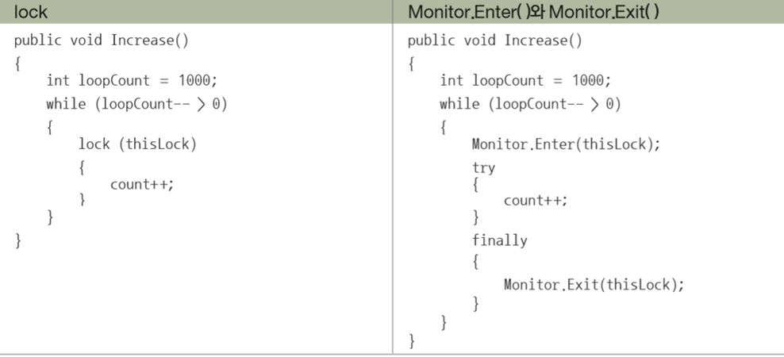


---

<details>
<summary> <b>예제 : UsingMonitor </summary></b>
<div>

```C#
using System;
using System.Threading;

namespace UsingMonitor
{
    class Counter
    {
        const int LOOP_COUNT = 1000;

        readonly object thisLock;

        private int count;
        public int Count
        {
            get { return count; }
        }

        public Counter()
        {
            thisLock = new object();
            count = 0;
        }

        public void Increase()
        {
            int loopCount = LOOP_COUNT;
            while (loopCount-- > 0)
            {
                Monitor.Enter(thisLock);
                try
                {
                    count++;
                }
                finally
                {
                    Monitor.Exit(thisLock);
                }
                Thread.Sleep(1);
            }
        }

        public void Decrease()
        {
            int loopCount = LOOP_COUNT;
            while (loopCount-- > 0)
            {
                Monitor.Enter(thisLock);
                try
                {
                    count--;
                }
                finally
                {
                    Monitor.Exit(thisLock);
                }
                Thread.Sleep(1);
            }
        }
    }

    class MainApp
    {
        static void Main(string[] args)
        {
            Counter counter = new Counter();

            Thread incThread = new Thread(
                new ThreadStart(counter.Increase));
            Thread decThread = new Thread(
                new ThreadStart(counter.Decrease));

            incThread.Start();
            decThread.Start();

            incThread.Join();
            decThread.Join();

            Console.WriteLine(counter.Count);
        }
    }
}


```
결과
```cmd
0

```
</div></details>


---


<br><br>
### 3. Monitor.Wait(), Monitor.Pulse()로 하는 저수준 동기화
- 두 메소드는 <b>반드시 lock 블록 안에서 호출해야 함</b>

---


- WaitSleepJoin 상태에 들어간 스레드는 <b>동기화</b>를 위해 갖고 있던 <b>lock</b>을 내려놓은 뒤, Waiting Queue에 입력되고, 다른 스레드가 <b>락을 얻어</b> 작업을 수행함.

---

<details>
<summary> <b>예제 : WaitPulse </summary></b>
<div>

```C#
using System;
using System.Threading;

namespace WaitPulse
{
    class Counter
    {
        const int LOOP_COUNT = 1000;

        readonly object thisLock;
        bool lockedCount = false;

        private int count;
        public int Count
        {
            get { return count; }
        }

        public Counter()
        {
            thisLock = new object();
            count = 0;
        }

        public void Increase()
        {
            int loopCount = LOOP_COUNT;

            while (loopCount-- > 0)
            {
                lock (thisLock)
                {
                    while (count > 0 || lockedCount == true)
                        Monitor.Wait(thisLock);

                    lockedCount = true;
                    count++;
                    lockedCount = false;

                    Monitor.Pulse(thisLock);
                }
            }
        }

        public void Decrease()
        {
            int loopCount = LOOP_COUNT;

            while (loopCount-- > 0)
            {
                lock (thisLock)
                {
                    while (count < 0 || lockedCount == true)
                        Monitor.Wait(thisLock);

                    lockedCount = true;
                    count--;
                    lockedCount = false;

                    Monitor.Pulse(thisLock);
                }
            }
        }
    }

    class MainApp
    {
        static void Main(string[] args)
        {
            Counter counter = new Counter();

            Thread incThread = new Thread(
                new ThreadStart(counter.Increase));
            Thread decThread = new Thread(
                new ThreadStart(counter.Decrease));

            incThread.Start();
            decThread.Start();

            incThread.Join();
            decThread.Join();

            Console.WriteLine(counter.Count);
        }
    }
}
```
결과
```cmd
0
```
</div></details>


---

### 결론
- lockedCount-다른 스레드가 사용하고 있는 지 판별 어떻게 사용? (순서가 궁금)
- 대체로 I D D I I D D I I ... 순서. 중간에 튀는 경우도 있음. 이에 대한 부분이 궁금해 찾아보며, 운영체제에서 스레드를 처리하는 부분 공부가 필요함을 느낌. 다음 주제로 운영체제를 선택

<br><br>

# 19.2 Task와 Task< TResult >, 그리고 Parallel
- Task, Task<T> : ThreadPool(이미 존재하는 스레드 풀에서 사용 가능한 작업 스레드를 할당 받아 사용하는 방식)로부터 스레드를 가져와 비동기 작업을 실행
    - 스레드풀 방식 - 1) ThreadPool, 2) 비동기 델리게이트, 3) Task, 4) Task<T>, 5) Background Worker 클래스

- <b>동기 코드(Synchronous)</b> : 메소드를 호출한 뒤에 이 메소드의 실행이 <b>완전히 종료(반환)</b>되어야만, 다음 메소드를 호출할 수 있음.
- <b>비동기 코드(Asynchronous)</b> : 메소드를 호출한 뒤에 메소드의 종료를 기다리지 않고 바로 다음 코드를 실행.
- 멀티 CPU -> 비동기 처리 시 병렬로 작업 스레드 실행, <b>어떤</b> 스레드가 <b>언제</b> 실행하는 지는 OS가 결정.

<br><br>

## 19.2.1 System.Threading.Tasks.Task 클래스
- Task클래스 : <b>Action 대리자</b>를 넘겨 받음. 즉, 반환형을 갖지 않는 메소드와 익명 메소드, 무명 함수 등.
- Task.Run()으로 Task의 생성과 시작을 단번에 함.

---

<details>
<summary> <b>예제 : UsingTask </summary></b>
<div>

```C#
using System;
using System.IO;
using System.Threading;
using System.Threading.Tasks;
using System.Collections.Generic;
namespace UsingTask
{
    class MainApp
    {
        static void Main(string[] args)
        {
            string srcFile = args[0];

            Action<object> FileCopyAction = (object state) =>
            {
                String[] paths = (String[])state;
                File.Copy(paths[0], paths[1]);

                Console.WriteLine("TaskID:{0}, ThreadID:{1}, {2} was copied to {3}",
                    Task.CurrentId, Thread.CurrentThread.ManagedThreadId,
                    paths[0], paths[1]);
            };

            Task t1 = new Task(
                FileCopyAction,
                new string[] { srcFile, srcFile + ".copy1" });

            Task t2 = Task.Run(() =>
            {
                FileCopyAction(new string[] { srcFile, srcFile + ".copy2" });
            });

            t1.Start();

            Task t3 = new Task(
                FileCopyAction,
                new string[] { srcFile, srcFile + ".copy3" });

            t3.RunSynchronously();

            t1.Wait();
            t2.Wait();
            t3.Wait();


            var myTask = Task<List<int>>.Run(
                () =>
                {
                    Thread.Sleep(1000);

                    List<int> list = new List<int>();
                    list.Add(3);
                    list.Add(4);
                    list.Add(5);

                    return list;
                }
            );

            myTask.Wait();

        }
    }
}

```
결과
```cmd
C:\Users\Affinity\source\repos\ConsoleApp7\ConsoleApp7\bin\Debug>ConsoleApp7.exe D:/test.txt
TaskID:1, ThreadID:1, D:/test.txt was copied to D:/test.txt.copy3
TaskID:2, ThreadID:4, D:/test.txt was copied to D:/test.txt.copy1
TaskID:3, ThreadID:3, D:/test.txt was copied to D:/test.txt.copy2

```
</div></details>


---

### 결론
- 여러번 실행 시 copy 순서가 랜덤임을 알 수 있음.
- task 1, 2, 3 동시에 실행 됨, 앞에 작성한 대로 어떤 스레드가 언제 실행하는지는 OS가 결정
- 비동기 처리를 병렬적으로 작업 스레드 실행.


<br><br>

## 19.2.2 코드의 비동기 실행 결과를 주는 Task< TResult > 클래스
- Task< TResult > : 코드의 비동기 실행 결과를 손쉽게 취합
- <b>Func 대리자로 받고, 결과를 반환받을 수 있음</b>
- Task< TResult >를 사용하더라도, Wait()을 호출하는 편이 좋음
- m개의 Task, n개의 CPU가 있는 시스템에서는 각 코어당 m/n만큼 각각 소수 찾기를 한다면 작업 시간이 훨씬 줄어들음.    

---

<details>
<summary> <b>예제 : TaskResult </summary></b>
<div>

```C#
using System;
using System.Collections.Generic;
using System.Threading.Tasks;

namespace TaskResult
{
    class MainApp
    {
        static bool IsPrime(long number)
        {
            if (number < 2)
                return false;

            if (number % 2 == 0 && number != 2)
                return false;

            for (long i = 2; i < number; i++)
            {
                if (number % i == 0)
                    return false;
            }

            return true;
        }

        static void Main(string[] args)
        {
            long from = Convert.ToInt64(args[0]);
            long to = Convert.ToInt64(args[1]);
            int taskCount = Convert.ToInt32(args[2]);

            Func<object, List<long>> FindPrimeFunc =
                (objRange) =>
                {
                    long[] range = (long[])objRange;
                    List<long> found = new List<long>();

                    for (long i = range[0]; i < range[1]; i++)
                    {
                        if (IsPrime(i))
                            found.Add(i);
                    }

                    return found;
                };

            Task<List<long>>[] tasks = new Task<List<long>>[taskCount];
            long currentFrom = from;
            long currentTo = to / tasks.Length;
            for (int i = 0; i < tasks.Length; i++)
            {
                Console.WriteLine("Task[{0}] : {1} ~ {2}",
                    i, currentFrom, currentTo);

                tasks[i] = new Task<List<long>>(FindPrimeFunc,
                    new long[] { currentFrom, currentTo });
                currentFrom = currentTo + 1;

                if (i == tasks.Length - 2) // 마지막에서 두 번째
                    currentTo = to;
                else
                    currentTo = currentTo + (to / tasks.Length);
            }

            Console.WriteLine("Please press enter to start...");
            Console.ReadLine();
            Console.WriteLine("Started...");

            DateTime startTime = DateTime.Now;

            foreach (Task<List<long>> task in tasks)
                task.Start();

            List<long> total = new List<long>();

            foreach (Task<List<long>> task in tasks)
            {
                task.Wait();
                total.AddRange(task.Result.ToArray());
            }
            DateTime endTime = DateTime.Now;

            TimeSpan ellapsed = endTime - startTime;

            Console.WriteLine("Prime number count between {0} and {1} : {2}",
                                                        from, to, total.Count);
            Console.WriteLine("Ellapsed time : {0}", ellapsed);
        }
    }
}

```
결과
```cmd
C:\Users\Affinity\source\repos\ConsoleApp7\ConsoleApp7\bin\Debug>ConsoleApp7.exe 0 100000 1
Task[0] : 0 ~ 100000
Please press enter to start...

Started...
Prime number count between 0 and 100000 : 9592
Ellapsed time : 00:00:03.9322891

C:\Users\Affinity\source\repos\ConsoleApp7\ConsoleApp7\bin\Debug>ConsoleApp7.exe 0 100000 5
Task[0] : 0 ~ 20000
Task[1] : 20001 ~ 40000
Task[2] : 40001 ~ 60000
Task[3] : 60001 ~ 80000
Task[4] : 80001 ~ 100000
Please press enter to start...

Started...
Prime number count between 0 and 100000 : 9592
Ellapsed time : 00:00:01.7840639

```
</div></details>

---

### 결론
- 0부터 시작하는 경우 편한 코드, 일반화시켜볼 수 있을 것 같다. (to-from)/task.Length가 더 task당 같은 개수로 배정할 수 있을 것 같음.

<br><br>

## 19.2.3 손쉬운 병렬 처리를 가능하게 하는 Parallel 클래스

- Task< TResult >, for문 등을 이용해서 구현했던 병렬 처리를 더 쉽게 구현할 수 있음.

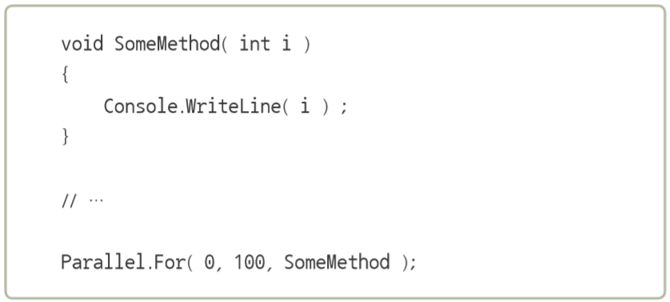

- Parallel.For() 메소드 : SomeMethod()를 병렬 호출하며 0부터 100까지의 정수를 메소드의 매개 변수로 넘김.
<b>-> 몇 개의 스레드를 사용할지는 Parallel 클래스가 내부적으로 판단하여 최적화</b>


---

<details>
<summary> <b>예제 : ParallelLoop </summary></b>
<div>

```C#
using System;
using System.Collections.Generic;
using System.Threading;
using System.Threading.Tasks;

namespace ParallelLoop
{
    class MainApp
    {
        static bool IsPrime(long number)
        {
            if (number < 2)
                return false;

            if (number % 2 == 0 && number != 2)
                return false;

            for (long i = 2; i < number; i++)
            {
                if (number % i == 0)
                    return false;
            }

            return true;
        }

        static void Main(string[] args)
        {
            long from = Convert.ToInt64(args[0]);
            long to = Convert.ToInt64(args[1]);

            Console.WriteLine("Please press enter to start...");
            Console.ReadLine();
            Console.WriteLine("Started...");

            DateTime startTime = DateTime.Now;
            List<long> total = new List<long>();

            Parallel.For(from, to, (long i) =>
            {
                if (IsPrime(i))
                    total.Add(i);
            });

            DateTime endTime = DateTime.Now;

            TimeSpan ellapsed = endTime - startTime;

            Console.WriteLine("Prime number count between {0} and {1} : {2}",
                                                        from, to, total.Count);
            Console.WriteLine("Ellapsed time : {0}", ellapsed);
        }
    }
}

```
결과
```cmd
C:\Users\Affinity\source\repos\ConsoleApp8\ConsoleApp8\bin\Debug>ConsoleApp8.exe 0 100000
Please press enter to start...

Started...
Prime number count between 0 and 100000 : 9591
Ellapsed time : 00:00:01.0084033

```
</div></details>

---

### 결론
- Parallel.For문 -> 다중 스레드가 병렬로 됨. from ~ to 순서대로 실행 X, but 한 번씩만 실행
- ★ ?? 왜 9592가 안 나오고 실행할 때마다 변경되어서 나오지..? ★
- cf. Parallel.Invoke() - 다른 task들을 병렬로 실행

<br><br>

# 19.3 async await
- async 한정자 : 메소드, 이벤트 처리기, 태스크, 람다식 등을 수식하며 호출결과를 기다리지 않고 다음 코드로 이동하도록 실행 코드를 생성하게 함.
- async 한정자의 반환 형식 - <b>Task, Task< TResult >, void</b>
    - void : 실행하고 잊어버릴 작업 (Shoot and Forget) -> <b> async 한정자 하나만으로 완전한 비동기 코드</b>
    - Task, Task< T > : 작업이 완료될 때까지 기다리는 메소드 -> <b> await 연산자 필요</b>, 없을 시 보통의 동기 코드처럼 동작
- await 연산자를 만나는 곳에서 호출자에게 제어를 돌려줌
    
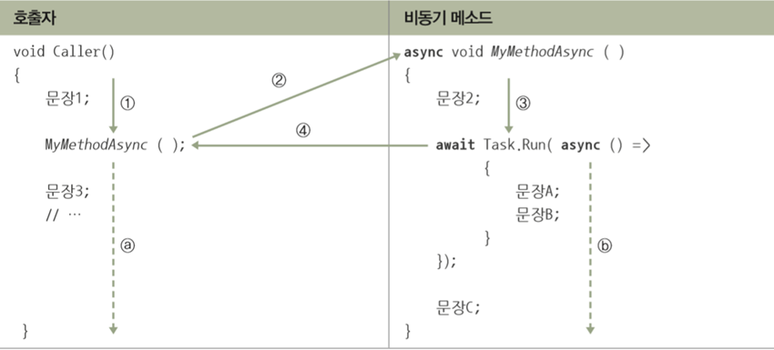

1. 1의 흐름을 따라 문장 1이 실행되고, 2를 따라 MyMethodAysnc 메소드의 실행으로 제어가 이동.
2. 메소드에서는 3을 따라 문장 2가 실행되고, await 연산자를 만남
3. 이 때 CLR은 4를 따라 제어를 호출자인 Caller()에게로 이동시킴
4. a와 b의 흐름을 동시에 실행하게 됨

---

<details>
<summary> <b>예제 : Async </summary></b>
<div>

```C#
using System;
using System.Threading.Tasks;

namespace Async
{
    class MainApp
    {
        async static private void MyMethodAsync(int count)
        {
            Console.WriteLine("C");
            Console.WriteLine("D");

            await Task.Run(async () =>
            {
                for (int i = 1; i <= count; i++)
                {
                    Console.WriteLine($"{i}/{count} ...");
                    await Task.Delay(100);
                }
            });

            Console.WriteLine("G");
            Console.WriteLine("H");
        }

        static void Caller()
        {
            Console.WriteLine("A");
            Console.WriteLine("B");

            MyMethodAsync(3);

            Console.WriteLine("E");
            Console.WriteLine("F");
        }

        static void Main(string[] args)
        {
            Caller();

            Console.ReadLine(); // 프로그램 종료 방지
        }
    }
}
```
결과
```cmd
C:\Users\Affinity\source\repos\ConsoleApp8\ConsoleApp8\bin\Debug>ConsoleApp8.exe
A
B
C
D
E
F
1/3 ...
2/3 ...
3/3 ...
G
H
```
</div></details>

---

### 결론
- .Delay() : 매개변수로 입력된 시간 후 Task 객체 반환, 스레드를 블록시키지 않음. .Sleep()과 역할은 동일함(.Sleep()은 블록시킴)


### 19.3.1 .NET 프레임워크가 제공하는 비동기 API 맛보기

---

- ~Async() 메소드 : 메소드가 실행되는 중간에도 사용자가 사용자 인터페이스에 접근하는 데 아무런 문제가 없게 함.
- cf) Sync() 메소드는 호출하고 나면 실행이 종료될 때까지 사용자 인터페이스가 사용자에게 거의 응답을 하지 못함.
